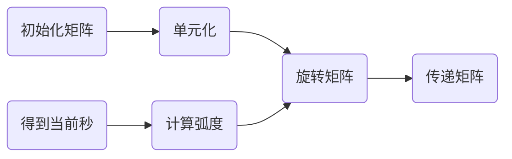

# 动画

## 矩阵变换

回到前面关于平移缩放、旋转的例子当中，我们是通过改变传递进去的xy的值来改变的。

在进行基础变换的时候，涉及到多个变量且变化频率高，在实际的webgl应用开发过程中，其复杂程度更令人发指，故引入了数学工具—矩阵。（具有规律性的二维数组）计算机实际上是一个固执的老顽童，它最喜欢有规律性质的东西，所以这样一拍即合，计算机技术与数学理论达成情人关系（webgl内置了矩阵系统）。本堂课的内容就是将变换过程转换成矩阵进行表示。

## glMatrix 常用API

> [glMatrix API 官网...](https://glmatrix.net/docs/module-mat4.html)
> ，补充：在使用glMatrix-0.9.6.min.js和npm上的glMatrix.js，API是有一定区别的，下面演示的是npm包

### 创建矩阵

返回类型是Float32Array，矩阵的元素个数是16，也就是一个4x4的矩阵。

```js
const matrix = mat4.create();
```

### 投影矩阵

生成具有给定边界的透视投影矩阵。far传递null/undefined/no值将生成无限投影矩阵。

```js
mat4.perspective(out, fovy, aspect, near, far);
mat4.perspective(matrix, 45, 4 / 3, 1, 100);
```

| 名称	    | 类型	    | 描述                       |
|--------|--------|--------------------------|
| out    | mat4   | mat4截头体矩阵将被写入            |
| fovy   | number | 垂直视场（弧度）                 |
| aspect | number | 宽高比。通常视口宽度/高度            |
| near   | number | 截头体的近界                   |
| far    | number | 截头体的远边界，可以为null或Infinity |

### 矩阵相乘

将两个mat 4相乘，参数一为目标矩阵，参数二三为要相乘的矩阵。

```js
const matrix = mat4.create();
const matrix1 = mat4.create();
let target = [];
mat4.multiply(target, matrix, matrix1);
```

### 单位矩阵

将一个矩阵设置为单位矩阵。单位矩阵是一个4x4的矩阵，其元素值都为0，除了主对角线元素值都为1。

```js
mat4.identity(matrix);
```

### 矩阵变化（平移、旋转、缩放）

平移缩放旋转都传递了两个矩阵参数，其中第一个参数是目标矩阵，第二个参数是变化矩阵（不做变换就和第一个传一样的值）。第三个参数是变化参数（平移的xyz值、缩放的xyz值、旋转的弧度和xyz值）。

```js
mat4.translate(matrix, matrix, [10, 10, 10]);
mat4.scale(matrix, matrix, [1, 2, 1]);
mat4.rotate(matrix, matrix, 45, [0, 0, 1]);
```

## WebGL+矩阵变化

修改着色器，添加一个中间矩阵，然后把中间矩阵传递给着色器。

```js
const vertexString = `
  attribute vec4 a_position;
  uniform mat4 u_formMatrix;
  void main(){
    gl_Position = u_formMatrix * a_position;
    gl_PointSize = 40.0;
  }`;
```

在js当中通过glMatrix.js进行矩阵变换，然后用webGL的uniformMatrix4fv方法传递给着色器。

```js
function animate() {
  const middleMat4 = mat4.create();
  mat4.identity(middleMat4);
  mat4.translate(middleMat4, [0, 0.5, 0]);
  mat4.rotate(middleMat4, 0.5 * Math.PI, [0, 0, 1]);
  mat4.scale(middleMat4, [0.5, 0.5, 0.5]);
  let uniformMatrix = webGL.getUniformLocation(program, 'u_formMatrix');
  webGL.uniformMatrix4fv(uniformMatrix, false, middleMat4);
}
```

## 案例：WebGL时钟效果

和上面webGL+矩阵变化的代码一样，在顶点着色器当中传入一个u_formMatrix用来计算，随后在initBuffer当中重新设置顶点坐标用来绘制三角带，如下

```js
let triangleArray = [
  0, -0.1, 0, 1.0,
  0, 0.4, 0, 1.0,
  0.01, 0.4, 0, 1.0,
  0.01, -0.1, 0, 1.0
];
webGL.drawArrays(webGL.TRIANGLE_FAN, 0, 4);
```

之后就是矩阵变换的代码，用rotate选择的方法去改变矩阵，以秒钟为例，那就是一秒钟走2*Math.PI弧度除以60，这样一分钟60秒刚好一圈，那么代码就是这样实现的。



```js
const second = new Date().getSeconds();
const rotate = 2 * Math.PI / 60 * second;
const middleMat4 = mat4.create();
mat4.identity(middleMat4);
mat4.rotate(middleMat4, -rotate, [0, 0, 1]);
let uniformMatrix = webGL.getUniformLocation(program, 'u_formMatrix');
webGL.uniformMatrix4fv(uniformMatrix, false, middleMat4);
```

随后分钟小时的代码就一样了，分钟和秒钟的计算是一样的，时针就是将60换成12即可。最后就是添加一个setInterval每隔一秒调用一次。注意：在这里绘制的时候，只需要在秒针绘制的时机先clear一遍，分针和时针的时候直接调用drawArray绘制即可，不用再次clear

> 完整代码地址：[https://github.com/lizuoqun/visualThree/blob/main/webGL/animate/clockTriangle.html](https://github.com/lizuoqun/visualThree/blob/main/webGL/animate/clockTriangle.html)