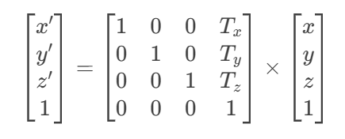
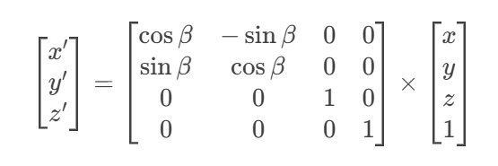
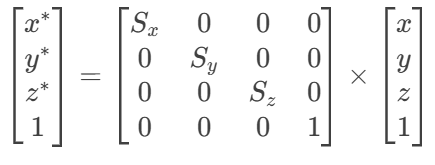
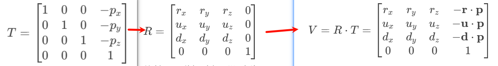
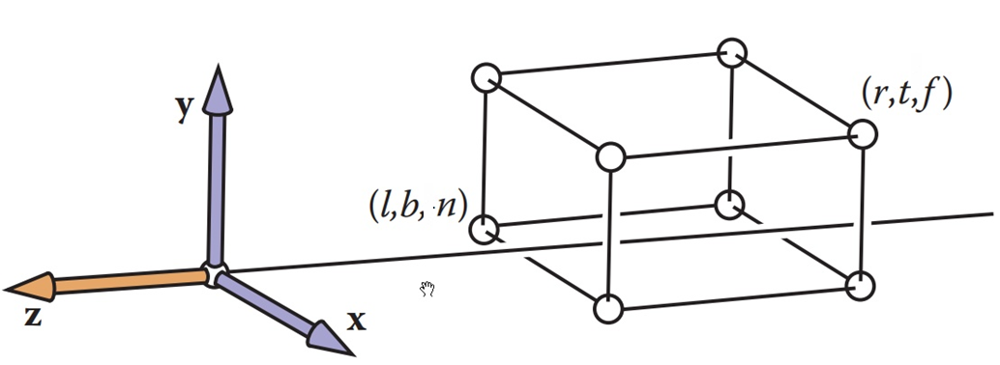
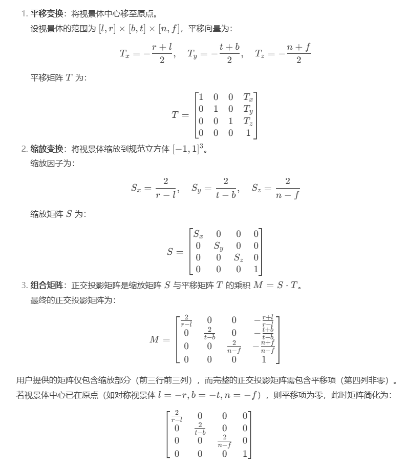
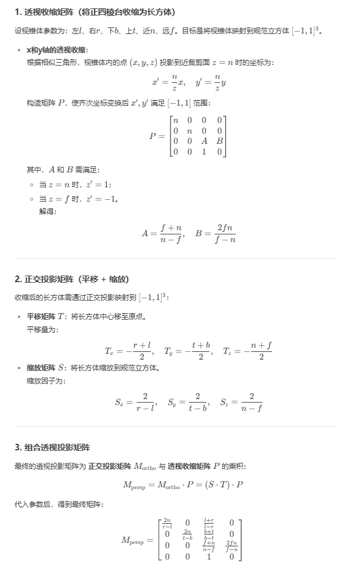
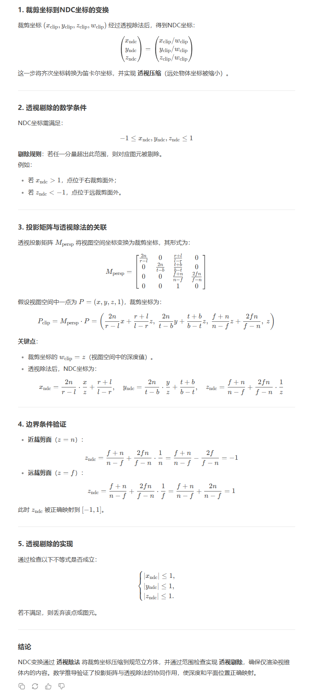
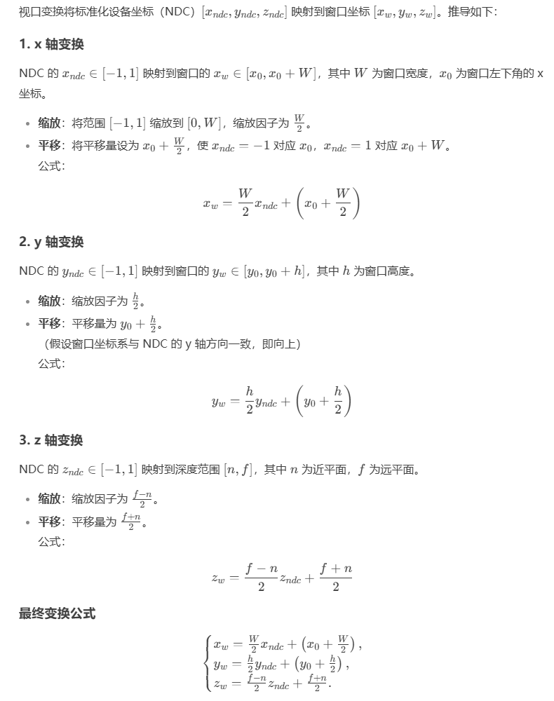

## 变换流水线


- 局部坐标系：是坐标系以物体的中心为坐标原点，物体的旋转、平移等操作都是围绕局部坐标系进行的，这时，当物体模型进行旋转或平移等操作时，局部坐标系也执行相应的旋转或平移操作。
- 世界坐标系：一个三维场景中通常都不会只有一个物体．我们真正需要的是把我们建立的物体按照我们所需要的形式摆放在场景之中．每个物体分布在场景的适当的位置上．整个场景的坐标系就称为世界坐标系
- 相机坐标系：相机的重心为原点，上方向为y轴，原点与视点的连线为z轴，x轴为yoz面的垂线
- 投影坐标系：是相机坐标系经过投影矩阵转换后得到的空间坐标系，之所以叫裁剪坐标系，是因为投影矩阵约定了视角的上下左右前后边界（对应的是相机的Frustum范围），后面会将处于边界之外的数据直接Clip到边界上
- 规范化设备坐标系（Normalized Device Coordinates）：NDC指的是与设备平台无关的一套三维坐标系（比如同一个物件，无论设备使用什么样的分辨率，在这个坐标系中的数值都是相同的）
- 屏幕坐标系：是NDC坐标系经过视口变换后得到的空间坐标系，即NDC坐标系在屏幕上所占的比例，即屏幕坐标系

## 模型变换

> 模型变换：是从模型坐标系到世界坐标系的转换。
>
> 简单通俗来讲，3D建模之初，模型有自己的坐标系，以及相应的点坐标。就是将场景中的模型摆好，这个过程就叫模型变换。

在复合变化当中，模型变换不同顺序有不同的结果，其实就是因为矩阵相乘不满足交换律，但满足结合律，所以对应同一个复合变换，可以先得出其中的基础变换的矩阵乘积，再与输入向量相乘。

### 齐次坐标

在欧式几何当中，最重要的一个定理是：两条平行线永不相交。但是在实际生活应用中有很多非欧式几何的场景，比如：透视空间、透视投影等。那么齐次坐标就是用来解决这个问题的。

#### 概述

齐次坐标是用n+1维向量表示n维向量的坐标系统，用于统一几何变换和表示无穷远点

1. 定义与基本概念
   齐次坐标是一种数学工具，通过增加一个额外维度将n维向量表示为n+1维向量。例如：

    - 二维点(x,y)的齐次坐标为(x,y,w)，其中w为非零实数，实际坐标可通过(x/w, y/w)还原。
    - 三维点(x,y,z)同理扩展为(x,y,z,w)。
    - 核心特点：齐次坐标具有规模不变性，即(kx,ky,kw）（k!=O）与原坐标(x,y,w)表示同一个点。

2. 引入齐次坐标的目的
    - 统一几何变换：在计算机图形学中，平移、旋转、缩放等变换可通过单一的4x4矩阵乘法完成，简化计算。
    - 表示无穷远点：当w=0时，(x,y,0)表示二维空间中的无穷远点（方向向量)，解决了欧氏坐标无法表达无限远的问题。
    - 射影几何兼容：平行线在射影空间中相交于无穷远点，齐次坐标为此提供了代数支持。
3. 规范化处理
    - 齐次坐标的规范化指将W置为1(即(x,y,w）→ (x/w,y/w,1))，以消除尺度不确定性，便于实际计算。
4. 数学原理示例
    - 平行线相交证明：
      在齐次坐标系下，两条平行线Ax+By+C=O和Ax+By+D=O可表示为Ax+By+Cw=O和Ax+By+Dw=0。当w=O时，解为(B,-A,0)，即无穷远交点。

#### 优势

1. 可以表示无穷远

---

2. 可以表示点在直线或者平面

在齐次坐标下，判断点是否位于直线或平面上的条件可统一表示为向量内积为零

**二维空间中点在直线上的判断**

- 直线表示：直线方程为 ax + by + c = 0 ，用齐次坐标表示为向量 l = (a, b, c) ^ T。
- 点的齐次坐标：点 P = (x, y) 的齐次坐标为 P' = (x, y, 1)。
- 判定条件：点 P 在直线 l 上的充要条件是内积 l x P' = 0 ，即： `ax + by + c*1 = 0 <=> ax + by + c = 0`
- 几何意义：内积为零等价于点坐标满足直线方程。

**三维空间中点在平面上的判断**

- 平面表示：平面方程为 ax + by + cz + d = 0 ，用齐次坐标表示为向量 s = (a, b, c, d)^T 。
- 点的齐次坐标：点 P = (x, y, z) 的齐次坐标为 P' = (x, y, z, 1) 。
- 判定条件：点 P 在平面 s 上的充要条件是内积 s * P' = 0 ，即： `ax + by + cz + d * 1 = 0 <=> ax + by + cz + d = 0`
- 几何意义：内积为零等价于点坐标满足平面方程。

**总结**

- 核心条件：点 P 的齐次坐标 P' 与直线 l 或平面 s 的内积为零。
- 优势：统一处理有限点和无穷远点，不依赖坐标缩放，简化几何计算。
- 公式表示：
    - 二维直线：l * P' = 0 其中 P' = (x, y, 1)
    - 三维平面：s * P' = 0 其中 P' = (x, y, z, 1)

---

3. 可以表示两条直线的交点

在齐次坐标下，两条直线 l 和 m 的交点可以通过叉乘运算直接计算，并利用点积条件验证其几何意义

**直线交点的齐次坐标表示**

- 叉乘定义：在二维投影几何中，两条直线 l = (a1, b1, c1)^T 和 m = (a2, b2, c2)^T 的交点 \( \mathbf{p} \) 由叉乘给出：
  > p = l * m

叉乘结果 p = (px, py, pw)^T 是一个齐次坐标点。

**交点满足两条直线的方程**

- 点积条件：若 p 是两直线的交点，则它必须同时位于 l 和 m 上。根据点在直线上的条件(l ^ T * p = 0) 和(m ^ T * p = 0)，可以验证：
  > l ^T * p = l ^ T (l * m) = 0
  >
  > m ^T * p = m ^ T (l * m) = 0

几何意义：叉乘结果 p 与 l 和 m 正交，因此满足直线方程。

**叉乘的几何解释**

- 正交性：叉乘l * m 生成的向量 p 与 l 和 m 均正交。在齐次坐标下，这等价于点 p 同时位于两直线上。
- 交点的唯一性：在投影平面中，两条不平行的直线必有唯一交点，叉乘直接给出了这一交点的齐次坐标。

**齐次坐标的归一化**

- 坐标形式：叉乘结果 p = (px, py, pw)^T 可能为齐次坐标，需归一化得到欧氏坐标：
  > 欧氏坐标 = ( p_x/p_w, p_y/p_w)  (若 p_w != 0).
- 无穷远点：若 p_w = 0，则 p 表示无穷远点，说明两直线在欧氏空间中平行。

---

4. 能够区分一个向量和一个点

**点和向量的区别**

- 点：表示空间中的一个具体位置，例如三维点(x,y,z)
- 向量：表示方向和大小，没有位置属性，例如位移向量(dx,dy,dz)

**普通坐标 → 齐次坐标**

- 点的转换：普通坐标点 (x, y, z) 转换为齐次坐标时，添加第四个分量 **1**:
  > 齐次坐标点：} \quad (x, y, z, 1).

- 向量的转换：普通坐标向量 (x, y, z) 转换为齐次坐标时，添加第四个分量 **0**：
  > 齐次坐标向量：(x, y, z, 0).

**齐次坐标 → 普通坐标**

- **点**的还原：若齐次坐标为 (x, y, z, 1)，直接去掉第四个分量 **1**，还原为普通坐标点：
  > 普通坐标点：(x, y, z)

- **向量**的还原：若齐次坐标为 \((x, y, z, 0)\)，去掉第四个分量 **0**，还原为普通坐标向量：
  > 普通坐标向量：(x, y, z)

### 不同方式的图形变换

#### 平移

让x的坐标+2表示沿着x平移

1. 手动变换

```js
const data = new Float32Array([
  1.0, 0.0, 0.0, 1.0,
  0.0, 1.0, 0.0, 1.0,
  0.0, 0.0, 1.0, 1.0,
])

const data = new Float32Array([
  3.0, 0.0, 0.0, 1.0,
  2.0, 1.0, 0.0, 1.0,
  2.0, 0.0, 1.0, 1.0,
])
```

2. js变换（CPU）

```js
for (let i = 0; i < data.length; i += 4) {
  data[i] += 2.0;
} 
```

3. 着色器（GPU）

```js
gl_Position = vec4(apos.x + 2.0, apos.y, apos.z, 1);
```

4. 平移矩阵



#### 旋转

1. 手动变换

```js
const newArray = new Float32Array([
  1.0, 0.0, 0.0, 1.0,
  1.0, 1.0, 0.0, 1.0,
  1.0, 0.0, 1.0, 1.0
]);

const newArray = new Float32Array([
  1.0, 0.0, 0.0, 1.0,
  1.0, 1.0, 0.0, 1.0,
  1.0, 0.0, 1.0, 1.0
]); 
```

2. js变换（CPU）

```js
const newArray = new Float32Array(data.length);
const angle = Math.PI / 2;
for (let i = 0; i < data.length; i += 4) {
  newArray[i] = data[i] * Math.cos(angle) - data[i + 1] * Math.sin(angle);
  newArray[i + 1] = data[i] * Math.sin(angle) + data[i + 1] * Math.cos(angle);
  newArray[i + 2] = data[i + 2];
  newArray[i + 3] = data[i + 3];
}
```

3. 着色器（GPU）

```js
gl_Position = vec4(apos.x * cosb - apos.y * sinb, apos.x * sinb + apos.y * cosb, apos.z, 1); 
```

4. 旋转矩阵



#### 缩放

1. 手动变换

```js
const newArray = new Float32Array([
  1.0, 0.0, 0.0, 1.0,
  1.0, 1.0, 0.0, 1.0,
  1.0, 0.0, 1.0, 1.0
]);

const newArray = new Float32Array([
  2.0, 0.0, 0.0, 1.0,
  2.0, 1.0, 0.0, 1.0,
  2.0, 0.0, 1.0, 1.0
]);
```

2. js变换（CPU）

```js
const newArray = new Float32Array(data.length);
for (let i = 0; i < data.length; i += 4) {
  newArray[i] = data[i] * 2;
  newArray[i + 1] = data[i + 1] * 2;
  newArray[i + 2] = data[i + 2] * 2;
  newArray[i + 3] = data[i + 3];
}
```

3. 着色器（GPU）

```js
gl_Position = vec4(apos.x * 2, apos.y * 2, apos.z * 2, 1);  
```

4. 缩放矩阵



## 视图变换

进入世界坐标系空间之后，物体与WebGL相机虽然建立了联系，但是并没有进一步确定观察物体的状态。当我们把相机的位置进行移动的时候，相机坐标系和世界坐标系不再重合。这意味着我们直接将世界坐标作为最终的坐标绘制，并不能正确的描述观察者和物体之间的位置关系。如图，我们将相机沿着
x 轴正方向移动 1 个单位。此时世界坐标系的原点（0，0，0）在相机坐标系中的坐标就变成（-1，0，0），这说明我们需要在两个坐标系之间进行转换！这个时候就需要调整相机位置姿态，也就是视图变换。

### 公式推导

可以看这个知乎的文章：[视图变换和投影变换矩阵的原理及推导，以及OpenGL，DirectX和Unity的对应矩阵](https://zhuanlan.zhihu.com/p/362713511)

在相机坐标系当中，分别用d（向前向量 direction）, u（向上向量 up ）, r（向右向量right）和p（位置 position）来表示这四个变量。
并假设待求的视图矩阵为V（将摄像机移动到原点），并将摄像机的三个向量分别与坐标轴对齐，d与z轴正方向对齐，u与y轴正方向对齐，r与x轴正方向对齐。假设将摄像机与坐标轴对齐的矩阵为V，那么V的推导过程如下

其中d、u、r通常这些向量是正交的，且满足右手坐标系的关系
> r = u × d , u = d × r , d = r × u

- 平移矩阵T：
    - 将相机的位置p移到原点
- 旋转矩阵R：
    - 将相机的三个正交单位向量r（右）、u（上）、d（前）旋转到与坐标轴对齐。旋转矩阵由这三个向量作为行向量构成
- 组合视图矩阵V：
    - 先应用平移，再应用旋转，因此矩阵相乘顺序为R * T



### 视图变换案例

**通过一个透视投影矩阵**，模拟人眼观察效果（FOV 视野角度）

```js
glMatrix.mat4.perspective(projMatrix, 30.0, canvas.width / canvas.height, 1.0, 100.0);
```

**初始化相机矩阵**（视图矩阵）使用 lookAt 函数创建视图矩阵，表示相机的位置、目标点和上方向

参数说明：修改 x, y, z 值会改变相机的目标点，从而调整视角

- [3.0, 3.0, 3.0]: 相机的初始位置（位于 (3, 3, 3) 点）
- [x, y, z]: 目标点，即相机看向的方向（由 setTranslate 的参数决定）
- [0.0, 1.0, 0.0]：上方向向量（Y轴向上）

```js
const viewMatrix = glMatrix.mat4.create();
glMatrix.mat4.lookAt(viewMatrix, [3.0, 3.0, 3.0], [x, y, z], [0.0, 1.0, 0.0]);
```

**创建模型矩阵并计算 MVP 矩阵：**

模型矩阵 (modelMatrix) 表示物体本身的变换（如平移、旋转等）

- MVP 矩阵是通过将投影矩阵 (projMatrix)、视图矩阵 (viewMatrix) 和模型矩阵 (modelMatrix) 相乘得到的
- 最终的 MVP 矩阵传递给着色器中的 u_formMatrix，用于顶点坐标变换

```js
let modelMatrix = glMatrix.mat4.create();
u_ModelMatrix = gl.getUniformLocation(gl.program, 'u_formMatrix');
MVPMatrix = glMatrix.mat4.create();
glMatrix.mat4.multiply(MVPMatrix, projMatrix, glMatrix.mat4.multiply(MVPMatrix, viewMatrix, modelMatrix));
gl.uniformMatrix4fv(u_ModelMatrix, false, MVPMatrix);
```

### 第一人称视角

第一人称视角的核心是相机始终位于观察者的“眼睛”位置，并朝向观察方向

**视线方向与水平方向计算**

- lookAtDirction: 从相机位置指向目标点的方向向量（即视线方向）
- rightDirection: 水平方向向量，通过视线方向与上方向叉乘得到

```js
const lookAtDirction = glMatrix.vec3.subtract(glMatrix.vec3.create(), lookAtPosition, eyePosition);
glMatrix.vec3.normalize(lookAtDirction, lookAtDirction);

const rightDirection = glMatrix.vec3.cross(glMatrix.vec3.create(), updirction, lookAtDirction);
glMatrix.vec3.normalize(rightDirection, rightDirection);
```

### 第三人称视角

与第一人称视角不同的是，相机始终位于观察对象的后方或侧面，用户可以看到自己控制的角色或物体

| 特性   | 第一人称视角        | 第三人称视角            |
|------|---------------|-------------------|
| 相机位置 | 位于“眼睛”位置，跟随移动 | 固定在角色背后或侧面，不随移动变化 |
| 目标点  | 始终指向视线前方      | 始终指向角色中心          |
| 移动方式 | 相机位置改变，视角跟随移动 | 角色移动，相机视角固定或绕其旋转  |
| 交互操作 | 按钮控制前后左右移动    | 按钮控制视角绕角色旋转       |
| 视觉体验 | 用户感觉自己在场景中行走  | 用户看到角色在场景中活动      |

## 投影变换

在前面已经了解了正交投影和透视投影，[WebGL图形编程实战【3】：矩阵操控 × 从二维到三维的跨越](https://blog.csdn.net/qq_44973159/article/details/146559236)

### 公式推导

#### 正交投影



正交投影可以分为两步：第一步为平移，第二步为缩放。将长方体（目标）投影到画布上



#### 透视投影



### 案例

在进行正交投影和透视投影的时候可以直接使用封装好的函数

```js
glMatrix.mat4.ortho(projMatrix, -1, 1, -1, 1, -1, 100);
glMatrix.mat4.perspective(projMatrix, 30.0, canvas.width / canvas.height, 1.0, 100.0);
```

## NDC变换



## 视口变换

该转换的目的在于将某个在ndc坐标系的点p(x, y, z) ，转换为屏幕坐标系中的点p1（x1, y1, z1) , 更具体的来说 就是将x轴的 [-1,1]
转换为[X,X + Width]，将y轴的[-1,1]转换为[Y,Y + Height], 将z轴的[-1,1] 转换为[near,far]

