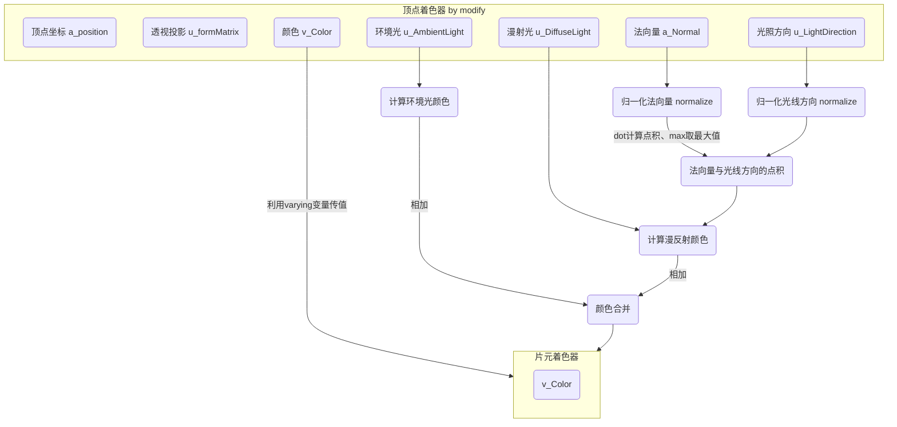

# 光照

> 现实世界中的物体被光线照射时，会反射一部分光。只有当反射光线进人你的眼睛时，你才能够看到物体并辩认出它的颜色。

## 光源类型

- 平行光（Directional
  Light）：光线是相互平行的，平行光具有方向。平行光可以看作是无限远处的光源（比如太阳）发出的光。因为太阳距离地球很远，所以阳光到达地球时可以认为是平行的。平行光很简单，可以用<font color="red">
  **一个方向**</font>和<font color="red">**一个颜色**</font>来定义
- 点光源（Point
  Light）：是从一个点向周围的所有方向发出的光。点光源光可以用来表示现实中的灯泡、火焰等。我们需要指定点光源的<font color="red">
  **位置和颜色**</font>。光线的方向将根据点光源的位置和被照射之处的位置计算出来，因为点光源的光线的方向在场景内的不同位置是不同的。
- 环境光（Ambient
  Light）：环境光（间接光）是指那些经光源（点光源或平行光源）发出后，被墙壁等物体多次反射，然后照到物体表面上的光。环境光从各个角度照射物体，其强度都是致的。比如说，在夜间打开冰箱的门，整个厨房都会有些微微亮，这就是环境光的作用。环境光不用指定位置和方向，只需要指定<font color="red">
  **颜色**</font>即可。

## 反射类型

- 漫反射（Diffuse
  Reflection）：是针对平行光或点光源而言的。漫反射的反射光在各个方向上是均匀的，如果物体表面像镜子一样光滑，那么光线就会以特定的角度反射出去；但是现实中的大部分材质，比如纸张、岩石、塑料等，其表面都是粗糙的，在这种情况下反射光就会以不固定的角度反射出去。
- 环境反射（Ambient Reflection）：环境反射是针对环境光而言的。在环境反射中，反射光的方向可以认为就是人射光的反方向。由于环境光照射物体的方式就是各方向均匀、强度相等的，所以反射光也是各向均匀的。

### 漫反射颜色公式

> 漫反射颜色 = 入射光颜色 * 表面基底色 * cos A

式子中，入射光颜色指的是点光源或平行光的颜色，乘法操作是在颜色矢量上逐分量（R、G、B）进行的。因为漫反射光在各个方向上都是“均匀”的，所以从任何角度看上去其强度都相等。

### 环境反射颜色公式

> 环境反射颜色 = 环境光颜色 * 表面基底色

当漫反射和环境反射同时存在时，将两者加起来，就会得到物体最终被观察到的颜色

### 计算入射角

根据入射光的方向和物体表面的朝向（即法线方向）来计算出入射角。在创建三维模型的时候，无法预先确定光线将以怎样的角度照射到每个表面上
但是可以确定每个表面的朝向。在指定光源的时候，再确定光的方向，就可以用这两项信息来计算出入射角了。

> 在线性代数当中，对矢量n和1作点积运算，公式为：n·1 = |n||1|cosA，其中||符号表示向量的模（长度）。如果两个矢量长度都是1，则点积运算结果为
> cosA。

那么就可以对前面漫反射颜色公式进行调整：
> 漫反射颜色 = 入射光颜色 * 表面基底色 * (光线方向 * 法线方向)
>
> - 光线方向矢量和表面法线矢量的长度必须为1（单位向量）
> - 光线方向，实际上是入射方向的反方向，即从入射点指向光源方向

**法线：表面朝向**

物体表面的朝向，即垂直于表面的方向，又称法线或法向量。法向量有三个分量，向量（Nx，Ny，Nz）表示从（0,0,0）到（Nx,Ny,Nz）的方向。

- 矢量n为（Nx,Ny,Nz）则其长度为|n| = sqrt(Nx^2 + Ny^2 + Nz^2)
- 对矢量进行归一化后的结果是（Nx/m,Ny/m,Nz/m）,其中m是n的的模。如矢量(2.0,2.0,1.0)的长度|n|=sqrt(2.0^2+2.0^2+1.0^2)=sqrt(9)
  =3.0，那么归一化后的结果是（2.0/3.0,2.0/3.0,1.0/3.0）

## 平行光

### 角度的余弦值

首先来补充一下数学知识，看一下各个角度的余弦值：（这里一起把正弦和正切都加上了）

| 角度 (°) | 余弦值 (Cos) | 正弦值 (Sin) | 正切值 (Tan) |
|--------|-----------|-----------|-----------|
| 0      | 1         | 0         | 0         |
| 30     | √3/2      | 1/2       | √3/3      |
| 45     | √2/2      | √2/2      | 1         |
| 60     | 1/2       | √3/2      | √3        |
| 90     | 0         | 1         | 无定义 (∞)   |
| 120    | -1/2      | √3/2      | -√3       |
| 135    | -√2/2     | √2/2      | -1        |
| 150    | -√3/2     | 1/2       | -√3/3     |
| 180    | -1        | 0         | 0         |
| 210    | -√3/2     | -1/2      | √3/3      |
| 225    | -√2/2     | -√2/2     | 1         |
| 240    | -1/2      | -√3/2     | √3        |
| 270    | 0         | -1        | 无定义 (-∞)  |
| 300    | 1/2       | -√3/2     | -√3       |
| 315    | √2/2      | -√2/2     | -1        |
| 330    | √3/2      | -1/2      | -√3/3     |
| 360    | 1         | 0         | 0         |

那么再根据前面的入射角的公式，那么我们简单计算一下几个案例，在反射之后的颜色值

> 漫反射颜色 = 入射光颜色 * 表面基底色 * (光线方向 * 法线方向) = 入射光颜色 * 表面基底色 * cos A

| 入射光颜色            | 表面基底色       | 角度 | 角度余弦值 | 计算RGB                                             | 漫反射颜色   |
|------------------|-------------|----|-------|---------------------------------------------------|---------|
| (1.0,1.0,1.0) 白色 | (1.0,0,0)红色 | 0  | 1.0   | R=(1 * 1 * 1)<br/>G=(1 * 0 * 1)<br/>B=(1 * 0 * 1) | (1,0,0) |
| (1.0,1.0,1.0) 白色 | (1.0,0,0)红色 | 90 | 0     | R=(1 * 1 * 0)<br/>G=(1 * 0 * 0)<br/>B=(1 * 0 * 0) | (0,0,0) |

### 平行光案例

补充：前面都是采用drawArray方法绘制的正方体，这样的话数组对象太多内容了，看的头都晕了，还可以采用drawElements对前面的代码进行重构优化一下。

数据对象可以进行一个拆分。boxArray数组表示的是每一个面的四个顶点的坐标位置，以第一行为例，就是从v0-v1-v2-v3的位置。那么对应的index就表示顶点位置的索引（因为一个正方形要拆分成两个三角形，这也是这里的index一行为什么是6个数据的原因）。

```js
    //    v6----- v5
    //   /|      /|
    //  v1------v0|
    //  | |     | |
    //  | |v7---|-|v4
    //  |/      |/
    //  v2------v3

let boxArray = [
  1.0, 1.0, 1.0, 1.0, -1.0, 1.0, 1.0, 1.0, -1.0, -1.0, 1.0, 1.0, 1.0, -1.0, 1.0, 1.0, // v0-v1-v2-v3
  1.0, 1.0, 1.0, 1.0, 1.0, -1.0, 1.0, 1.0, 1.0, -1.0, -1.0, 1.0, 1.0, 1.0, -1.0, 1.0, // v0-v3-v4-v5
  1.0, 1.0, 1.0, 1.0, 1.0, 1.0, -1.0, 1.0, -1.0, 1.0, -1.0, 1.0, -1.0, 1.0, 1.0, 1.0, // v0-v5-v6-v1
  -1.0, 1.0, 1.0, 1.0, -1.0, 1.0, -1.0, 1.0, -1.0, -1.0, -1.0, 1.0, -1.0, -1.0, 1.0, 1.0, // v1-v6-v7-v2
  -1.0, -1.0, -1.0, 1.0, 1.0, -1.0, -1.0, 1.0, 1.0, -1.0, 1.0, 1.0, -1.0, -1.0, 1.0, 1.0, // v7-v4-v3-v2
  1.0, -1.0, -1.0, 1.0, -1.0, -1.0, -1.0, 1.0, -1.0, 1.0, -1.0, 1.0, 1.0, 1.0, -1.0, 1.0 // v4-v7-v6-v5
];

let index = [
  0, 1, 2, 0, 2, 3,    // front
  4, 5, 6, 4, 6, 7,    // right
  8, 9, 10, 8, 10, 11,    // up
  12, 13, 14, 12, 14, 15,    // left
  16, 17, 18, 16, 18, 19,    // down
  20, 21, 22, 20, 22, 23     // back
];

```

后面进行数据组合的方法和之前是一样的。注意一下绑定的着色器的变量即可，以及最后drawElements方法，

```js
let pointPosition = new Float32Array(boxArray);
let aPsotion = webGL.getAttribLocation(program, 'a_position');
let triangleBuffer = webGL.createBuffer();
webGL.bindBuffer(webGL.ARRAY_BUFFER, triangleBuffer);
webGL.bufferData(webGL.ARRAY_BUFFER, pointPosition, webGL.STATIC_DRAW);
webGL.enableVertexAttribArray(aPsotion);
webGL.vertexAttribPointer(aPsotion, 4, webGL.FLOAT, false, 4 * 4, 0);

let indexBuffer = webGL.createBuffer();
let indices = new Uint8Array(index);
webGL.bindBuffer(webGL.ELEMENT_ARRAY_BUFFER, indexBuffer);
webGL.bufferData(webGL.ELEMENT_ARRAY_BUFFER, indices, webGL.STATIC_DRAW);

webGL.drawElements(webGL.TRIANGLES, 36, webGL.UNSIGNED_BYTE, 0);
```

平行光案例实现：调整着色器代码，看一下整个着色器代码调整的完整流程。



通过这个流程图也就结合了前面计算漫反射公式得到了漫反射的颜色，所以最后在片元着色器中利用varying变量传值，进行颜色合并。那么也就渲染到了物体上。

```js
  let vertexString = `
  attribute vec4 a_position;
  uniform mat4 u_formMatrix;
  attribute vec4 a_Normal;
  uniform vec3 u_LightDirection;
  uniform vec3 u_DiffuseLight;
  uniform vec3 u_AmbientLight;
  varying vec4 v_Color;
  void main(void){
    gl_Position = u_formMatrix * a_position;
    vec3 normal = normalize(a_Normal.xyz);
    vec3 LightDirection = normalize(u_LightDirection.xyz);
    float nDotL = max(dot(LightDirection, normal), 0.0);
    vec3 diffuse = u_DiffuseLight * vec3(1.0,0,1.0)* nDotL;
    vec3 ambient = u_AmbientLight * vec3(1.0,0,1.0);
    v_Color = vec4(diffuse + ambient, 1);
  }`;
let fragmentString = `
  precision mediump float;
  varying vec4 v_Color;
  void main(void){
    gl_FragColor =v_Color;
  }
  `;
```

第二步就是设置法向量和光线方向，以及漫反射和环境光。而后结合前面的通过drawElements进行绘制。那也就完成了平行光案例。

```js
let normals = new Float32Array([
  0.0, 0.0, 1.0, 0.0, 0.0, 1.0, 0.0, 0.0, 1.0, 0.0, 0.0, 1.0,  // v0-v1-v2-v3 front
  1.0, 0.0, 0.0, 1.0, 0.0, 0.0, 1.0, 0.0, 0.0, 1.0, 0.0, 0.0,  // v0-v3-v4-v5 right
  0.0, 1.0, 0.0, 0.0, 1.0, 0.0, 0.0, 1.0, 0.0, 0.0, 1.0, 0.0,  // v0-v5-v6-v1 up
  -1.0, 0.0, 0.0, -1.0, 0.0, 0.0, -1.0, 0.0, 0.0, -1.0, 0.0, 0.0,  // v1-v6-v7-v2 left
  0.0, -1.0, 0.0, 0.0, -1.0, 0.0, 0.0, -1.0, 0.0, 0.0, -1.0, 0.0,  // v7-v4-v3-v2 down
  0.0, 0.0, -1.0, 0.0, 0.0, -1.0, 0.0, 0.0, -1.0, 0.0, 0.0, -1.0   // v4-v7-v6-v5 back
]);
let aNormal = webGL.getAttribLocation(program, 'a_Normal');
let normalsBuffer = webGL.createBuffer();
let normalsArr = new Float32Array(normals);
webGL.bindBuffer(webGL.ARRAY_BUFFER, normalsBuffer);
webGL.bufferData(webGL.ARRAY_BUFFER, normalsArr, webGL.STATIC_DRAW);
webGL.enableVertexAttribArray(aNormal);
webGL.vertexAttribPointer(aNormal, 3, webGL.FLOAT, false, 3 * 4, 0);

let u_DiffuseLight = webGL.getUniformLocation(program, 'u_DiffuseLight');
webGL.uniform3f(u_DiffuseLight, 1.0, 1.0, 1.0);
let u_LightDirection = webGL.getUniformLocation(program, 'u_LightDirection');
webGL.uniform3fv(u_LightDirection, [0, 0, 10.0]);
let u_AmbientLight = webGL.getUniformLocation(program, 'u_AmbientLight');
webGL.uniform3f(u_AmbientLight, 0.2, 0.2, 0.2);
```