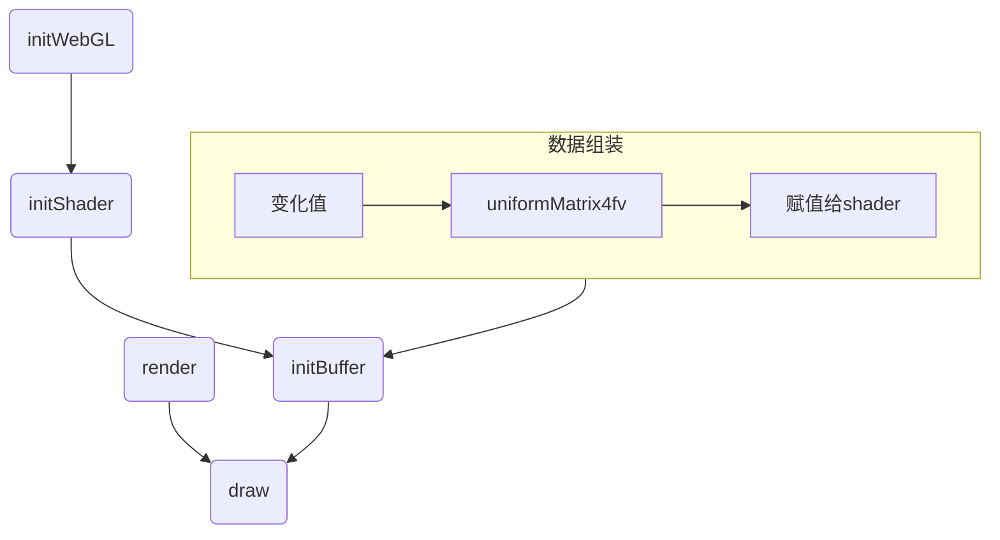
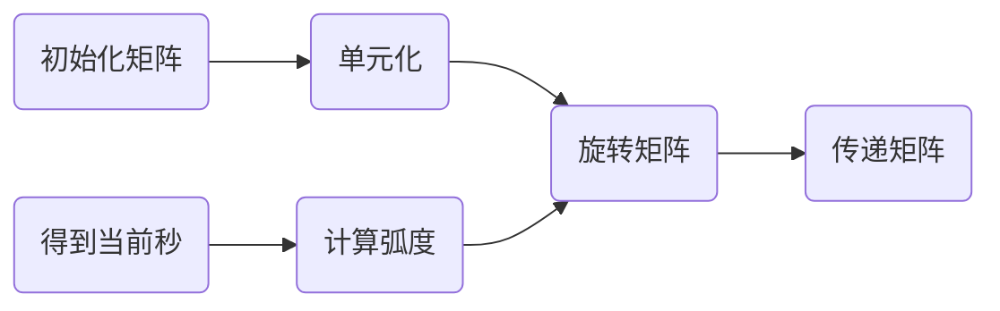
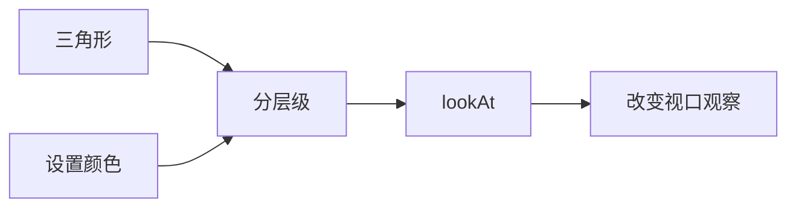

# 矩阵操控

## 矩阵变换

回到前面关于平移缩放、旋转的例子当中，我们是通过改变传递进去的xy的值来改变的。

在进行基础变换的时候，涉及到多个变量且变化频率高，在实际的webgl应用开发过程中，其复杂程度更令人发指，故引入了数学工具—矩阵。（具有规律性的二维数组）计算机实际上是一个固执的老顽童，它最喜欢有规律性质的东西，所以这样一拍即合，计算机技术与数学理论达成情人关系（webgl内置了矩阵系统）。本堂课的内容就是将变换过程转换成矩阵进行表示。

### 矩阵动画推演

下面先展示了在数学方面上对xyz轴的数据进行相对应的变化，而后是在矩阵层面上变化的值

#### 平移

```js
x1 = x + Tx;
y1 = y + Ty;
z1 = z + Tz;
```

#### 旋转

```js
x1 = x * cos(angle) - y * sin(angle);
y1 = y * cos(angle) + x * sin(angle);
```

#### 缩放

```js
x1 = x * Sx;
y1 = y * Sy;
z1 = z * Sz;
```

### 矩阵运算案例

#### 加（减）法

只有同型矩阵之间才可以进行加（减）法运算，将两个矩阵相同位置的元相加即可，m行n列的两个矩阵相加（减）后得到一个新的m行n列矩阵，例如

```math
1,2,3,4  +  3,4,5,6  =  4,6,8,10
2,3,4,5  +  2,3,4,5  =  4,6,8,10
```

#### 数乘

数乘即将矩阵乘以一个常量，矩阵中的每个元都与这个常量相乘，例如

```math
1,2,3  *  3  =  3,6,9
```

#### 乘法

两个矩阵的乘法仅当第一个矩阵的列数和另一个矩阵的行数相等时才能定义

```math
1,2,3  *  3,4  =  1*3+2*2+3*3  1*4+2*3+3*4  = 16 22
2,3,4  *  2,3  =  2*3+3*2+4*3  2*4+3*3+4*4  = 24 33
          3,4  =  
```

## glMatrix 常用API

> [glMatrix API 官网...](https://glmatrix.net/docs/module-mat4.html)
>
> 补充：在使用glMatrix-0.9.6.min.js和npm上的glMatrix.js，API是有一定区别的，下面是用最新的glMatrix

### 创建矩阵

返回类型是Float32Array，矩阵的元素个数是16，也就是一个4x4的矩阵。

```js
const matrix = mat4.create();
```

### 投影矩阵

生成具有给定边界的透视投影矩阵。far传递null/undefined/no值将生成无限投影矩阵。

```js
mat4.perspective(out, fovy, aspect, near, far);
mat4.perspective(matrix, 45, 4 / 3, 1, 100);
```

| 名称	    | 类型	    | 描述                       |
|--------|--------|--------------------------|
| out    | mat4   | mat4截头体矩阵将被写入            |
| fovy   | number | 垂直视场（弧度）                 |
| aspect | number | 宽高比。通常视口宽度/高度            |
| near   | number | 截头体的近界                   |
| far    | number | 截头体的远边界，可以为null或Infinity |

### 矩阵相乘

将两个mat 4相乘，参数一为目标矩阵，参数二三为要相乘的矩阵。

```js
const matrix = mat4.create();
const matrix1 = mat4.create();
let target = [];
mat4.multiply(target, matrix, matrix1);
```

### 单位矩阵

将一个矩阵设置为单位矩阵。单位矩阵是一个4x4的矩阵，其元素值都为0，除了主对角线元素值都为1。

```js
mat4.identity(matrix);
```

### 矩阵变化（平移、旋转、缩放）

平移缩放旋转都传递了两个矩阵参数，其中第一个参数是目标矩阵，第二个参数是变化矩阵（不做变换就和第一个传一样的值）。第三个参数是变化参数（平移的xyz值、缩放的xyz值、旋转的弧度和xyz值）。

```js
mat4.translate(matrix, matrix, [10, 10, 10]);
mat4.scale(matrix, matrix, [1, 2, 1]);
mat4.rotate(matrix, matrix, 45, [0, 0, 1]);
```

## WebGL+矩阵变化

整体逻辑如下mermaid图



修改着色器，添加一个中间矩阵，然后把中间矩阵传递给着色器。版本为0.9.6

```js
const vertexString = `
  attribute vec4 a_position;
  uniform mat4 u_formMatrix;
  void main(){
    gl_Position = u_formMatrix * a_position;
    gl_PointSize = 40.0;
  }`;
```

在js当中通过glMatrix.js进行矩阵变换，然后用webGL的uniformMatrix4fv方法传递给着色器。

uniformMatrix4fv 为 uniform 变量指定矩阵值

- 参数一：是指定待修改 uniform 变量的存储位置
- 参数二：指定是否转置矩阵
- 参数三：序列值

```js
function animate() {
  const middleMat4 = mat4.create();
  mat4.identity(middleMat4);
  mat4.translate(middleMat4, [0, 0.5, 0]);
  mat4.rotate(middleMat4, 0.5 * Math.PI, [0, 0, 1]);
  mat4.scale(middleMat4, [0.5, 0.5, 0.5]);
  let uniformMatrix = webGL.getUniformLocation(program, 'u_formMatrix');
  webGL.uniformMatrix4fv(uniformMatrix, false, middleMat4);
}
```

## 案例：WebGL时钟效果

和上面webGL+矩阵变化的代码一样，在顶点着色器当中传入一个u_formMatrix用来计算，随后在initBuffer当中重新设置顶点坐标用来绘制三角带，如下

```js
let triangleArray = [
  0, -0.1, 0, 1.0,
  0, 0.4, 0, 1.0,
  0.01, 0.4, 0, 1.0,
  0.01, -0.1, 0, 1.0
];
webGL.drawArrays(webGL.TRIANGLE_FAN, 0, 4);
```

之后就是矩阵变换的代码，用rotate选择的方法去改变矩阵，以秒钟为例，那就是一秒钟走2*Math.PI弧度除以60，这样一分钟60秒刚好一圈，那么代码就是这样实现的。



```js
const second = new Date().getSeconds();
const rotate = 2 * Math.PI / 60 * second;
const middleMat4 = mat4.create();
mat4.identity(middleMat4);
mat4.rotate(middleMat4, -rotate, [0, 0, 1]);
let uniformMatrix = webGL.getUniformLocation(program, 'u_formMatrix');
webGL.uniformMatrix4fv(uniformMatrix, false, middleMat4);
```

随后分钟小时的代码就一样了，分钟和秒钟的计算是一样的，时针就是将60换成12即可。最后就是添加一个setInterval每隔一秒调用一次。注意：在这里绘制的时候，只需要在秒针绘制的时机先clear一遍，分针和时针的时候直接调用drawArray绘制即可，不用再次clear

>
完整代码地址：[https://github.com/lizuoqun/visualThree/blob/main/webGL/animate/clockTriangle.html](https://github.com/lizuoqun/visualThree/blob/main/webGL/animate/clockTriangle.html)

# 三维世界

## 视点 & 视线

观察者的位置就是视点，从视点出发，观察者能看到的就是视线。

### 调整视口观察三维对象



前面的案例研究了xy轴的二维平面对象，而三维就是给z设置了对应的值，而改变观察的方向就能看到不同的结果。这里以三角形绘制为例，参考前面的代码实现，先绘制三个三角形，并且修改其z轴的值，在三个不同的平面上

```js
let triangleArray = [
  0.0, 0.5, -0.4, 1.0,
  -0.5, -0.5, -0.4, 1.0,
  0.5, -0.5, -0.4, 1.0,

  0.5, 0.4, -0.2, 1.0,
  -0.5, 0.4, -0.2, 1.0,
  0.0, -0.6, -0.2, 1.0,

  0.0, 0.4, 0.0, 1,
  -0.4, -0.4, 0.0, 1,
  0.4, -0.4, 0.0, 1
];
```

给每一个层级的三角形设置一下不同的颜色，上面可以区分有三个层级，分别位于z的-0.4、-0.2、0.0三个位置上，修改这个数组对象，就代表着一个点对象有八个数值，分别是x、y、z、1、r、g、b、a，将颜色值和点绑定在一起

```js
let triangleArray = [
  0.0, 0.5, -0.4, 1.0, 0.4, 1.0, 0.4, 1,
  -0.5, -0.5, -0.4, 1.0, 0.4, 1.0, 0.4, 1,
  0.5, -0.5, -0.4, 1.0, 0.4, 1.0, 0.4, 1,

  0.5, 0.4, -0.2, 1.0, 1.0, 0.4, 0.4, 1,
  -0.5, 0.4, -0.2, 1.0, 1.0, 0.4, 0.4, 1,
  0.0, -0.6, -0.2, 1.0, 1.0, 0.4, 0.4, 1,

  0.0, 0.4, 0.0, 1, 0.4, 0.4, 1.0, 1,
  -0.4, -0.4, 0.0, 1, 0.4, 0.4, 1.0, 1,
  0.4, -0.4, 0.0, 1, 0.4, 0.4, 1.0, 1
];
```

修改着色器代码，这里使用varying变量，先将颜色值传递给顶点着色器，再透传给片元着色器中，根据varying变量的值，设置颜色。

```js
// 顶点着色器
const vertexString = `
  attribute vec4 a_position;
  attribute vec4 a_color;
  varying vec4 color;
    void main(){
      gl_Position =  a_position;
      color = a_color;
  }`;

// 片元着色器
const fragmentString = `
  precision mediump float;
  varying vec4 color;
  void main(){
    gl_FragColor = color;
  }`;
```

进行赋值，在js当中通过vertexAttribPointer将颜色值传递给着色器当中的a_color变量，同时因为数组的内容改了，之前是4个数据一个点现在是8个数据一个点，所以设置点的代码也要调整

```js
// 设置点坐标
webGL.vertexAttribPointer(aPosition, 4, webGL.FLOAT, false, 8 * 4, 0);
// 调整不同层级三角形的颜色
let aColor = webGL.getAttribLocation(program, 'a_color');
webGL.enableVertexAttribArray(aColor);
webGL.vertexAttribPointer(aColor, 4, webGL.FLOAT, false, 8 * 4, 4 * 4);
```

改变视角：在顶点着色器当中添加u_formMatrix，使用lookAt方法设置视点，并传递给着色器中

```js
let modelView = mat4.create();
mat4.identity(modelView);
modelView = mat4.lookAt(modelView, [0, -0.5, 0.2], [0, 0, 0], [0, 1, 0]);
let uniformMatrix = webGL.getUniformLocation(program, 'u_formMatrix');
webGL.uniformMatrix4fv(uniformMatrix, false, modelView);
```

**lookAt(out, eye, center, up)：** 使用给定的眼睛位置、焦点和上方向轴生成注视矩阵

参数说明

| 名称	    | 类型	          | 描述        |
|--------|--------------|-----------|
| out    | mat4         | 截头体矩阵将被写入 |
| eye    | ReadonlyVec3 | 视口位置      |
| center | ReadonlyVec3 | 观看者正在观看的点 |
| up     | ReadonlyVec3 | 指定上方向     |

### 叠加矩阵变化

可以再创建一个新的矩阵进行旋转90度，之后将视口矩阵和旋转矩阵乘积重新赋值也就完成了叠加矩阵变化。

```js
let ModelMatrix = mat4.create();
mat4.identity(ModelMatrix);
mat4.rotate(ModelMatrix, ModelMatrix, Math.PI / 2, [0, 0, 1]);

let ViewMatrix = mat4.create();
mat4.identity(ViewMatrix);
ViewMatrix = mat4.lookAt(ViewMatrix, [0, 0, 0.3], [0, 0, 0], [0, 1, 0]);
let mvMatrix = mat4.create();
mat4.multiply(mvMatrix, ViewMatrix, ModelMatrix);
// 最后将这个进行赋值
let uniformMatrix = webGL.getUniformLocation(program, 'u_formMatrix');
webGL.uniformMatrix4fv(uniformMatrix, false, mvMatrix);
```