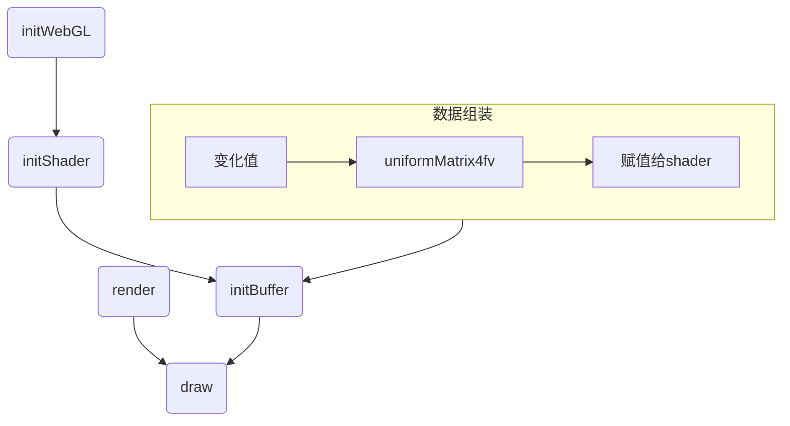
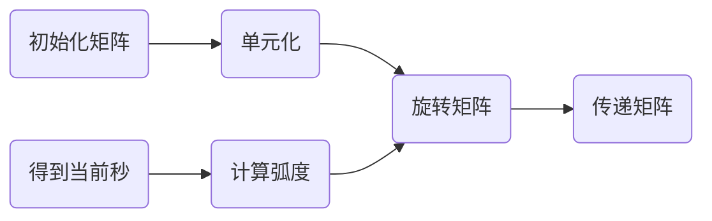
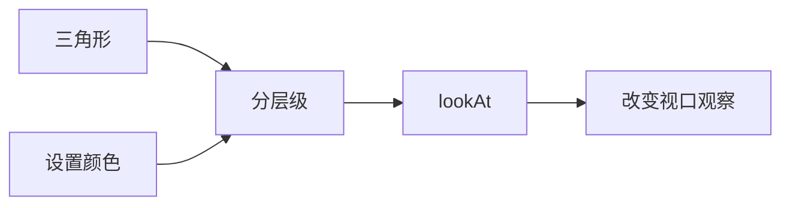
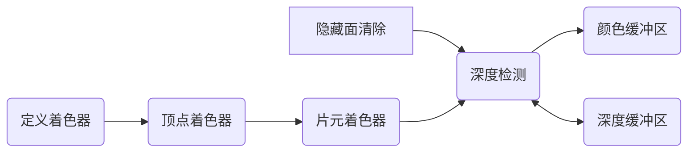

# 矩阵操控

## 矩阵变换

回到前面关于平移缩放、旋转的例子当中，我们是通过改变传递进去的xy的值来改变的。

在进行基础变换的时候，涉及到多个变量且变化频率高，在实际的webgl应用开发过程中，其复杂程度更令人发指，故引入了数学工具—矩阵。（具有规律性的二维数组）计算机实际上是一个固执的老顽童，它最喜欢有规律性质的东西，所以这样一拍即合，计算机技术与数学理论达成情人关系（webgl内置了矩阵系统）。本堂课的内容就是将变换过程转换成矩阵进行表示。

### 矩阵动画推演

下面先展示了在数学方面上对xyz轴的数据进行相对应的变化，而后是在矩阵层面上变化的值

#### 平移

```js
x1 = x + Tx;
y1 = y + Ty;
z1 = z + Tz;
```

#### 旋转

```js
x1 = x * cos(angle) - y * sin(angle);
y1 = y * cos(angle) + x * sin(angle);
```

#### 缩放

```js
x1 = x * Sx;
y1 = y * Sy;
z1 = z * Sz;
```

### 矩阵运算案例

#### 加（减）法

只有同型矩阵之间才可以进行加（减）法运算，将两个矩阵相同位置的元相加即可，m行n列的两个矩阵相加（减）后得到一个新的m行n列矩阵，例如

```math
1,2,3,4  +  3,4,5,6  =  4,6,8,10
2,3,4,5  +  2,3,4,5  =  4,6,8,10
```

#### 数乘

数乘即将矩阵乘以一个常量，矩阵中的每个元都与这个常量相乘，例如

```math
1,2,3  *  3  =  3,6,9
```

#### 乘法

两个矩阵的乘法仅当第一个矩阵的列数和另一个矩阵的行数相等时才能定义

```math
1,2,3  *  3,4  =  1*3+2*2+3*3  1*4+2*3+3*4  = 16 22
2,3,4  *  2,3  =  2*3+3*2+4*3  2*4+3*3+4*4  = 24 33
          3,4  =  
```

## glMatrix 常用API

> [glMatrix API 官网...](https://glmatrix.net/docs/module-mat4.html)
>
> 补充：在使用glMatrix-0.9.6.min.js和npm上的glMatrix.js，API是有一定区别的，下面是用最新的glMatrix

### 创建矩阵

返回类型是Float32Array，矩阵的元素个数是16，也就是一个4x4的矩阵。

```js
const matrix = mat4.create();
```

### 投影矩阵

生成具有给定边界的透视投影矩阵。far传递null/undefined/no值将生成无限投影矩阵。

```js
mat4.perspective(out, fovy, aspect, near, far);
mat4.perspective(matrix, 45, 4 / 3, 1, 100);
```

| 名称	    | 类型	    | 描述                       |
|--------|--------|--------------------------|
| out    | mat4   | mat4截头体矩阵将被写入            |
| fovy   | number | 垂直视场（弧度）                 |
| aspect | number | 宽高比。通常视口宽度/高度            |
| near   | number | 截头体的近界                   |
| far    | number | 截头体的远边界，可以为null或Infinity |

### 矩阵相乘

将两个mat 4相乘，参数一为目标矩阵，参数二三为要相乘的矩阵。

```js
const matrix = mat4.create();
const matrix1 = mat4.create();
let target = [];
mat4.multiply(target, matrix, matrix1);
```

### 单位矩阵

将一个矩阵设置为单位矩阵。单位矩阵是一个4x4的矩阵，其元素值都为0，除了主对角线元素值都为1。

```js
mat4.identity(matrix);
```

### 矩阵变化（平移、旋转、缩放）

平移缩放旋转都传递了两个矩阵参数，其中第一个参数是目标矩阵，第二个参数是变化矩阵（不做变换就和第一个传一样的值）。第三个参数是变化参数（平移的xyz值、缩放的xyz值、旋转的弧度和xyz值）。

```js
mat4.translate(matrix, matrix, [10, 10, 10]);
mat4.scale(matrix, matrix, [1, 2, 1]);
mat4.rotate(matrix, matrix, 45, [0, 0, 1]);
```

## WebGL+矩阵变化

整体逻辑如下mermaid图



修改着色器，添加一个中间矩阵，然后把中间矩阵传递给着色器。版本为0.9.6

```js
const vertexString = `
  attribute vec4 a_position;
  uniform mat4 u_formMatrix;
  void main(){
    gl_Position = u_formMatrix * a_position;
    gl_PointSize = 40.0;
  }`;
```

在js当中通过glMatrix.js进行矩阵变换，然后用webGL的uniformMatrix4fv方法传递给着色器。

uniformMatrix4fv 为 uniform 变量指定矩阵值

- 参数一：是指定待修改 uniform 变量的存储位置
- 参数二：指定是否转置矩阵
- 参数三：序列值

```js
function animate() {
  const middleMat4 = mat4.create();
  mat4.identity(middleMat4);
  mat4.translate(middleMat4, [0, 0.5, 0]);
  mat4.rotate(middleMat4, 0.5 * Math.PI, [0, 0, 1]);
  mat4.scale(middleMat4, [0.5, 0.5, 0.5]);
  let uniformMatrix = webGL.getUniformLocation(program, 'u_formMatrix');
  webGL.uniformMatrix4fv(uniformMatrix, false, middleMat4);
}
```

## 案例：WebGL时钟效果

和上面webGL+矩阵变化的代码一样，在顶点着色器当中传入一个u_formMatrix用来计算，随后在initBuffer当中重新设置顶点坐标用来绘制三角带，如下

```js
let triangleArray = [
  0, -0.1, 0, 1.0,
  0, 0.4, 0, 1.0,
  0.01, 0.4, 0, 1.0,
  0.01, -0.1, 0, 1.0
];
webGL.drawArrays(webGL.TRIANGLE_FAN, 0, 4);
```

之后就是矩阵变换的代码，用rotate选择的方法去改变矩阵，以秒钟为例，那就是一秒钟走2*Math.PI弧度除以60，这样一分钟60秒刚好一圈，那么代码就是这样实现的。



```js
const second = new Date().getSeconds();
const rotate = 2 * Math.PI / 60 * second;
const middleMat4 = mat4.create();
mat4.identity(middleMat4);
mat4.rotate(middleMat4, -rotate, [0, 0, 1]);
let uniformMatrix = webGL.getUniformLocation(program, 'u_formMatrix');
webGL.uniformMatrix4fv(uniformMatrix, false, middleMat4);
```

随后分钟小时的代码就一样了，分钟和秒钟的计算是一样的，时针就是将60换成12即可。最后就是添加一个setInterval每隔一秒调用一次。注意：在这里绘制的时候，只需要在秒针绘制的时机先clear一遍，分针和时针的时候直接调用drawArray绘制即可，不用再次clear

>
完整代码地址：[https://github.com/lizuoqun/visualThree/blob/main/webGL/animate/clockTriangle.html](https://github.com/lizuoqun/visualThree/blob/main/webGL/animate/clockTriangle.html)

# 三维世界

## 视点 & 视线

观察者的位置就是视点，从视点出发，观察者能看到的就是视线。

### 调整视口观察三维对象



前面的案例研究了xy轴的二维平面对象，而三维就是给z设置了对应的值，而改变观察的方向就能看到不同的结果。这里以三角形绘制为例，参考前面的代码实现，先绘制三个三角形，并且修改其z轴的值，在三个不同的平面上

```js
let triangleArray = [
  0.0, 0.5, -0.4, 1.0,
  -0.5, -0.5, -0.4, 1.0,
  0.5, -0.5, -0.4, 1.0,

  0.5, 0.4, -0.2, 1.0,
  -0.5, 0.4, -0.2, 1.0,
  0.0, -0.6, -0.2, 1.0,

  0.0, 0.4, 0.0, 1,
  -0.4, -0.4, 0.0, 1,
  0.4, -0.4, 0.0, 1
];
```

给每一个层级的三角形设置一下不同的颜色，上面可以区分有三个层级，分别位于z的-0.4、-0.2、0.0三个位置上，修改这个数组对象，就代表着一个点对象有八个数值，分别是x、y、z、1、r、g、b、a，将颜色值和点绑定在一起

```js
let triangleArray = [
  0.0, 0.5, -0.4, 1.0, 0.4, 1.0, 0.4, 1,
  -0.5, -0.5, -0.4, 1.0, 0.4, 1.0, 0.4, 1,
  0.5, -0.5, -0.4, 1.0, 0.4, 1.0, 0.4, 1,

  0.5, 0.4, -0.2, 1.0, 1.0, 0.4, 0.4, 1,
  -0.5, 0.4, -0.2, 1.0, 1.0, 0.4, 0.4, 1,
  0.0, -0.6, -0.2, 1.0, 1.0, 0.4, 0.4, 1,

  0.0, 0.4, 0.0, 1, 0.4, 0.4, 1.0, 1,
  -0.4, -0.4, 0.0, 1, 0.4, 0.4, 1.0, 1,
  0.4, -0.4, 0.0, 1, 0.4, 0.4, 1.0, 1
];
```

修改着色器代码，这里使用varying变量，先将颜色值传递给顶点着色器，再透传给片元着色器中，根据varying变量的值，设置颜色。

```js
// 顶点着色器
const vertexString = `
  attribute vec4 a_position;
  attribute vec4 a_color;
  varying vec4 color;
    void main(){
      gl_Position =  a_position;
      color = a_color;
  }`;

// 片元着色器
const fragmentString = `
  precision mediump float;
  varying vec4 color;
  void main(){
    gl_FragColor = color;
  }`;
```

进行赋值，在js当中通过vertexAttribPointer将颜色值传递给着色器当中的a_color变量，同时因为数组的内容改了，之前是4个数据一个点现在是8个数据一个点，所以设置点的代码也要调整

```js
// 设置点坐标
webGL.vertexAttribPointer(aPosition, 4, webGL.FLOAT, false, 8 * 4, 0);
// 调整不同层级三角形的颜色
let aColor = webGL.getAttribLocation(program, 'a_color');
webGL.enableVertexAttribArray(aColor);
webGL.vertexAttribPointer(aColor, 4, webGL.FLOAT, false, 8 * 4, 4 * 4);
```

改变视角：在顶点着色器当中添加u_formMatrix，使用lookAt方法设置视点，并传递给着色器中

```js
let modelView = mat4.create();
mat4.identity(modelView);
modelView = mat4.lookAt(modelView, [0, -0.5, 0.2], [0, 0, 0], [0, 1, 0]);
let uniformMatrix = webGL.getUniformLocation(program, 'u_formMatrix');
webGL.uniformMatrix4fv(uniformMatrix, false, modelView);
```

**lookAt(out, eye, center, up)：** 使用给定的眼睛位置、焦点和上方向轴生成注视矩阵

参数说明

| 名称	    | 类型	          | 描述        |
|--------|--------------|-----------|
| out    | mat4         | 截头体矩阵将被写入 |
| eye    | ReadonlyVec3 | 视口位置      |
| center | ReadonlyVec3 | 观看者正在观看的点 |
| up     | ReadonlyVec3 | 指定上方向     |

### 叠加矩阵变化

可以再创建一个新的矩阵进行旋转90度，之后将视口矩阵和旋转矩阵乘积重新赋值也就完成了叠加矩阵变化。

```js
let ModelMatrix = mat4.create();
mat4.identity(ModelMatrix);
mat4.rotate(ModelMatrix, ModelMatrix, Math.PI / 2, [0, 0, 1]);

let ViewMatrix = mat4.create();
mat4.identity(ViewMatrix);
ViewMatrix = mat4.lookAt(ViewMatrix, [0, 0, 0.3], [0, 0, 0], [0, 1, 0]);
let mvMatrix = mat4.create();
mat4.multiply(mvMatrix, ViewMatrix, ModelMatrix);
// 最后将这个进行赋值
let uniformMatrix = webGL.getUniformLocation(program, 'u_formMatrix');
webGL.uniformMatrix4fv(uniformMatrix, false, mvMatrix);
```

## 可视范围（正射投影）

在上一个案例当中，当视点在极右或极左的位置时，三角形会缺少一部分。原因是没有指定可视范围，即实际观察得到的区域边界

两类常用的可视空间：

- 长方体可视空间，也称盒状空间，由正射投影产生
- 四棱锥/金字塔可视空间，由透视投影产生

可视空间由前后两个矩形表面确定，分别称近裁剪面（near）和远裁剪面（far）

改变视口可视域：**ortho(out, left, right, bottom, top, near, far)**：生成具有给定边界的正交投影矩阵

| 名称	    | 类型	    | 描述      |
|--------|--------|---------|
| out    | mat4   | 输出矩阵    |
| left   | number | 截头体的左边界 |
| right  | number | 右边界     |
| bottom | number | 底边界     |
| top    | number | 上边界     |
| near   | number | 近       |
| far    | number | 远       |

改变视口可视域，通过ortho方法设置可视域范围，这样他的坐标系取值就变成了canvas的坐标系，绘制图形的坐标值也要进行相对应的调整

```js
let ProjMatrix = mat4.create();
mat4.identity(ProjMatrix);
mat4.ortho(ProjMatrix, -100, 100, -100, 100, near, far);    //修改可视域范围

let uniformMatrix = webGL.getUniformLocation(program, 'u_formMatrix');
webGL.uniformMatrix4fv(uniformMatrix, false, ProjMatrix);
```

### 可视空间（透视投影）

在正射投影的可视空间中，不管三角形与视点的距离是远是近，它有多大，那么画出来就有多大。为了打破这条限制，使用透视投影可视空间，它将使场景具有深度性

设置透视投影：**perspective(out, fovy, aspect, near, far)**：生成具有给定边界的透视投影矩阵

| 名称	    | 类型	    | 描述                    |
|--------|--------|-----------------------|
| out    | mat4   | 输出矩阵                  |
| fovy   | number | 垂直方向的视野角度（上截面与下截面的角度） |
| aspect | number | 纵横比（宽高比）              |
| near   | number | 近                     |
| far    | number | 远                     |

创建一个透视投影矩阵，并赋值给uniformMatrix，去修改传入的角度的时候可以观察到变化

```js
let ProjMatrix = mat4.create();
mat4.identity(ProjMatrix);
//角度小，看到的物体大，角度大，看到的物体小。
mat4.perspective(ProjMatrix, 160 * Math.PI / 180, 1, 1, 100); //修改可视域范围
```

#### 正射投影和透视投影的区别

- 在透视投影下，产生的三维场景看上去更是有深度感，更加自然，因为我们平时观察真实世界用的也是透视投影。在大多数情况下，比如三维射击类游戏中，我们都应当采用透视投影。
- 正射投影的好处是用户可以方便地比较场景中物体( 比如两个原子的模型)
  的大小，这是因为物体看上去的大小与其所在的位置没有关系。在建筑平面图等技术绘图的相关场合，应当使用这种投影。

## 深度缓冲区

在透视投影当中，因为视角观察到的范围是一个棱锥，那么越在视角后面的图像就越小。这样就产生了深度感，正射投影矩阵的工作仅仅是将顶点从盒状的可视空间映射到规范立方体中。顶点着色器输出的顶点都必须在规范立方体中，这样才会显示在屏幕上。

### 画家算法（Painter's Algorithm）

是一种用于解决渲染顺序问题的经典方法，其核心思想来源于传统绘画中的“先远后近”原则。这种方法的基本理念是：先绘制距离摄像机较远的物体，再绘制距离摄像机较近的物体
，从而确保近处的物体会覆盖远处的物体，达到正确的视觉效果。

接下来直接看案例：这里展示绘制的三角形数据（使用透视投影），其他的init、initShader、draw都不是重点，先不贴上来了。

```js
let arr = [
  0.0, 100, -80, 1, 1, 0, 0, 1,
  -50, -100, -80, 1, 1, 0, 0, 1,
  50, -100, -80, 1, 1, 0, 0, 1,// 红色

  0, 100, -60, 1, 1.0, 1.0, 0.4, 1,
  -50, -100, -60, 1, 1.0, 1.0, 0.4, 1,
  50, -100, -60, 1, 1.0, 1.0, 0.4, 1,// 黄色

  0.0, 100, -35.0, 1, 0.4, 0.4, 1.0, 1,
  -50, -100, -35.0, 1, 0.4, 0.4, 1.0, 1,
  50, -100, -35.0, 1, 0.4, 0.4, 1.0, 1 // 蓝色
];
```

这里主要观察z轴的大小，可以发现是由远及近的，那么这样绘制的时候效果也就是我们想要的效果，就是最近的是蓝色、其次是黄色、最后是红色。但是当我们改变数组顺序的时候，也就是说将绘制红色的挪动到最后，然后会发现红色虽然z是最远的，但是他却在最前面

**这是因为：** WebGL在默认情况下会按照缓冲区中的顺序绘制图形，而且后绘制的图形覆盖先绘
制的图形，因为这样做很高效。如果场景中的对象不发生运动，观察者的状态也是唯一的，那么这种做法没有问题。但是如果，比如说你希望不断移动视点，从不同的角度看物体，
那么你不可能事先决定对象出现的顺序。

解决方案：在webGL当中提供了隐藏面消除，只需要以下两步：

- 开启隐藏面消除功能：gl.enable(gl.DEPTH_TEST);
    - 参数可选：
    - gl.BLEND：启用混合
    - gl.POLYGON_OFFSET_FILL：启用多边形偏移
- 绘制前清除缓冲区：gl.clear(gl.DEPTH_BUFFER_BIT);

深度检测：是通过检测物体的每个像素的的深度来决定是否将其画出来的



那么只要调整一下draw方法即可

```js
function draw() {
  webGL.clearColor(0, 0, 0, 1);
  webGL.clear(webGL.COLOR_BUFFER_BIT | webGL.DEPTH_BUFFER_BIT);
  webGL.enable(webGL.DEPTH_TEST);
  webGL.drawArrays(webGL.TRIANGLES, 0, 9);
}
```

### 深度冲突

当几何图形或物体的两个表面极为接近时，使得表面看上去斑斑驳驳的，这种现象被称为深度冲突(Zfighting)

在webGL当中可以通过多边形偏移（polygonoffset）的机制来解决这个问题。该机制将自动在Z值加上一个偏移量，偏移量的值由物体表面相对于观察者视线的角度来确定

- 启用多边形偏移：gl.enable(gl.POLYGON_OFFSET_FILL);
- 指定计算偏移量的系数和常量：gl.polygonOffset(factor, units);

## 正方体

### 绘制简单的正方体

在前面学习当中绘制正方形的话，那就是绘制两个三角形，将三角形拼接成一个正方形。先来看一下怎么取到正方体8个顶点的坐标。

> 补充：在三角形的顶点连接顺序，是逆时针的。这个是WebGL
> 的默认设置，当顶点顺序为逆时针时，这个平面代表正面，顺时针为背面。WebGL有一个背面剔除的功能，开启此功能之后，背面是不会被绘制的。这个能力主要是在绘制3D物体时使用，对性能有一定的优化作用。

那么我们以0,0,0位于正方体的中心，每边都是1的距离，那么就可以得到整个正方体当中的三角形的顶点位置

```js
let boxArray = [
  1, 1, 1, 1, -1, 1, 1, 1, -1, -1, 1, 1, 1, 1, 1, 1, -1, -1, 1, 1, 1, -1, 1, 1,   // 前面

  1, 1, -1, 1, 1, 1, 1, 1, 1, -1, 1, 1, 1, 1, -1, 1, 1, -1, 1, 1, 1, -1, -1, 1,  // 右

  -1, 1, -1, 1, 1, 1, -1, 1, 1, -1, -1, 1, -1, 1, -1, 1, 1, -1, -1, 1, -1, -1, -1, 1, // 后

  -1, 1, 1, 1, -1, 1, -1, 1, -1, -1, -1, 1, -1, 1, 1, 1, -1, -1, -1, 1, -1, -1, 1, 1, // 左

  -1, 1, -1, 1, -1, 1, 1, 1, 1, 1, 1, 1, -1, 1, -1, 1, 1, 1, 1, 1, 1, 1, -1, 1,  // 上

  -1, -1, 1, 1, -1, -1, -1, 1, 1, -1, -1, 1, -1, -1, 1, 1, 1, -1, -1, 1, 1, -1, 1, 1  // 下
];
```

得到了顶点坐标之后进行绘制三角形，并且加上透视投影的效果，这样一个正方体就绘制完成了。

### 设置颜色

在前面已经了解到了通过varying来进行颜色传递，先修改着色器

```js
let vertexString = `
  attribute vec4 a_position;
  uniform mat4 u_formMatrix;
  uniform mat4 proj;
  attribute vec4 a_color;
  varying vec4 color;
  void main(void){
    gl_Position = u_formMatrix * a_position;
    color = a_color;
  }`;
let fragmentString = `
  precision mediump float;
  varying vec4 color;
  void main(){
    gl_FragColor = color;
  }`;
```

而后就是调整数组的内容了，原本是一个面6个点，那么要在每一个点后面加上一个颜色值，那么简单随便调整一下array

```js
    let boxArray = [
      1, 1, 1, 1, 0.4, 1.0, 1.0, 1.0, -1, 1, 1, 1, 0.4, 1.0, 1.0, 1.0, -1, -1, 1, 1, 1.0, 1.0, 1.0, 1.0, 1, 1, 1, 1, 1.0, 1.0, 1.0, 1.0, -1, -1, 1, 1, 1.0, 1.0, 1.0, 1.0, 1, -1, 1, 1, 1.0, 1.0, 1.0, 1.0,  //前面

      1, 1, -1, 1, 0.4, 0.0, 1.0, 1.0, 1, 1, 1, 1, 0.0, 1.0, 1.0, 1.0, 1, -1, 1, 1, 0.0, 1.0, 1.0, 1.0, 1, 1, -1, 1, 0.0, 1.0, 1.0, 1.0, 1, -1, 1, 1, 0.0, 1.0, 1.0, 1.0, 1, -1, -1, 1, 0.0, 1.0, 1.0, 1.0, //右

      -1, 1, -1, 1, 1.0, 0.0, 0.0, 1.0, 1, 1, -1, 1, 1.0, 0.0, 0.0, 1.0, 1, -1, -1, 1, 1.0, 0.0, 0.0, 1.0, -1, 1, -1, 1, 1.0, 0.0, 0.0, 1.0, 1, -1, -1, 1, 1.0, 0.0, 0.0, 1.0, -1, -1, -1, 1, 1.0, 0.0, 0.0, 1.0,//后

      -1, 1, 1, 1, 1.0, 1.0, 1, 1.0, -1, 1, -1, 1, 1.0, 1.0, 1, 1.0, -1, -1, -1, 1, 1.0, 1.0, 1, 1.0, -1, 1, 1, 1, 1.0, 1.0, 1, 1.0, -1, -1, -1, 1, 1.0, 1.0, 1, 1.0, -1, -1, 1, 1, 1.0, 1.0, 1, 1.0,//左

      -1, 1, -1, 1, 0.0, 1.0, 1.0, 1.0, -1, 1, 1, 1, 0.0, 1.0, 1.0, 1.0, 1, 1, 1, 1, 0.0, 1.0, 1.0, 1.0, -1, 1, -1, 1, 0.0, 1.0, 1.0, 1.0, 1, 1, 1, 1, 0.0, 1.0, 1.0, 1.0, 1, 1, -1, 1, 0.0, 1.0, 1.0, 1.0, //上

      -1, -1, 1, 1, 1.0, 1.0, 0, 1.0, -1, -1, -1, 1, 1.0, 1.0, 0, 1.0, 1, -1, -1, 1, 1.0, 1.0, 0, 1.0, -1, -1, 1, 1, 1.0, 1.0, 0, 1.0, 1, -1, -1, 1, 1.0, 1.0, 0, 1.0, 1, -1, 1, 1, 1.0, 1.0, 0, 1.0 //下
    ];
```

最后使用同样的方法进行设置颜色传递，这样也就完成了颜色自定义

```js
let aColor = webGL.getAttribLocation(program, 'a_color');
webGL.enableVertexAttribArray(aColor);
webGL.vertexAttribPointer(aColor, 4, webGL.FLOAT, false, 8 * 4, 4 * 4);
```

### 设置纹理

同样的，在前面已经了解了怎么设置纹理，这里简单过一遍，先需要在着色器当中接收一个UV坐标，是对应三角形的UV值，然后需要传递一个texture纹理对象，将纹理对象和UV值进行合并就完成了纹理渲染

```js
let vertexString = `
  attribute vec4 a_position;
  uniform mat4 u_formMatrix;
  uniform mat4 proj;
  attribute vec2 a_outUV;
  varying vec2 v_inUV;
  void main(void){
    gl_Position = u_formMatrix * a_position;
    v_inUV = a_outUV;
  }`;
let fragmentString = `
  precision mediump float;
  uniform sampler2D texture;
  varying vec2 v_inUV;
  void main(){
    gl_FragColor = texture2D(texture, v_inUV);
  }`;
```
在这个着色器当中，我们接收了一个UV坐标，这个坐标就是对应三角形的UV值，然后通过vertexAttribPointer将UV坐标传递给到着色器，这样就剩下一个texture对象没有传递了
```js
    let boxArray = [
      1, 1, 1, 1, 1, 1, -1, 1, 1, 1, 0, 1, -1, -1, 1, 1, 0, 0, 1, 1, 1, 1, 1, 1, -1, -1, 1, 1, 0, 0, 1, -1, 1, 1, 1, 0,   //前面

      1, 1, -1, 1, 1, 1, 1, 1, 1, 1, 0, 1, 1, -1, 1, 1, 0, 0, 1, 1, -1, 1, 1, 1, 1, -1, 1, 1, 0, 0, 1, -1, -1, 1, 1, 0,  //右

      -1, 1, -1, 1, 1, 1, 1, 1, -1, 1, 0, 1, 1, -1, -1, 1, 0, 0, -1, 1, -1, 1, 1, 1, 1, -1, -1, 1, 0, 0, -1, -1, -1, 1, 1, 0, //后

      -1, 1, 1, 1, 1, 1, -1, 1, -1, 1, 1, 0, -1, -1, -1, 1, 0, 0, -1, 1, 1, 1, 1, 1, -1, -1, -1, 1, 0, 0, -1, -1, 1, 1, 1, 0, //左

      -1, 1, -1, 1, 0, 1, -1, 1, 1, 1, 0, 0, 1, 1, 1, 1, 1, 0, -1, 1, -1, 1, 0, 1, 1, 1, 1, 1, 1, 0, 1, 1, -1, 1, 1, 1,  //上

      -1, -1, 1, 1, 0, 1, -1, -1, -1, 1, 0, 0, 1, -1, -1, 1, 1, 0, -1, -1, 1, 1, 0, 1, 1, -1, -1, 1, 1, 0, 1, -1, 1, 1, 1, 1  //下
    ];

let attribOutUV = webGL.getAttribLocation(program, 'a_outUV');
webGL.enableVertexAttribArray(attribOutUV);
webGL.vertexAttribPointer(attribOutUV, 2, webGL.FLOAT, false, 6 * 4, 4 * 4);
```

传递texture对象，和前面设置纹理的代码是一样的。

```js
let uniformTexture = webGL.getUniformLocation(program, 'texture');
let texture = initTexture('../assets/image/box.png');

function initTexture(imageFile) {
  let textureHandle = webGL.createTexture();
  textureHandle.image = new Image();
  textureHandle.image.src = imageFile;
  textureHandle.image.onload = function () {
    handleLoadedTexture(textureHandle);
  };
  return textureHandle;
}

function handleLoadedTexture(texture) {
  webGL.bindTexture(webGL.TEXTURE_2D, texture);
  webGL.pixelStorei(webGL.UNPACK_FLIP_Y_WEBGL, 666);
  webGL.texImage2D(webGL.TEXTURE_2D, 0, webGL.RGBA, webGL.RGBA, webGL.UNSIGNED_BYTE, texture.image);
  webGL.texParameteri(webGL.TEXTURE_2D, webGL.TEXTURE_MAG_FILTER, webGL.LINEAR);// 纹理放大方式
  webGL.texParameteri(webGL.TEXTURE_2D, webGL.TEXTURE_MIN_FILTER, webGL.LINEAR);// 纹理缩小方式
  webGL.texParameteri(webGL.TEXTURE_2D, webGL.TEXTURE_WRAP_S, webGL.CLAMP_TO_EDGE);// 纹理水平填充方式
  webGL.texParameteri(webGL.TEXTURE_2D, webGL.TEXTURE_WRAP_T, webGL.CLAMP_TO_EDGE);// 纹理垂直填充方式
  draw();
}

function draw() {
  webGL.clearColor(0, 0, 0, 1);
  webGL.clear(webGL.COLOR_BUFFER_BIT | webGL.DEPTH_BUFFER_BIT);
  webGL.enable(webGL.DEPTH_TEST);
  webGL.activeTexture(webGL.TEXTURE0);
  webGL.bindTexture(webGL.TEXTURE_2D, texture);
  webGL.uniform1i(uniformTexture, 0);
  webGL.drawArrays(webGL.TRIANGLES, 0, 36);
}
```

### 正方体运动

