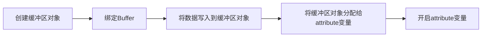

# 颜色 & 纹理

## 传递非坐标数据到顶点着色器

在前面的例子中，我们传递了顶点坐标到顶点着色器，然后由顶点着色器计算出顶点在屏幕上的位置。然后例子当中也有一个大小的值。下面用来实现传递大小值给点

修改顶点着色器代码

```js
let vertexString = `
    attribute vec4 a_position;
    attribute float size1;
    uniform float size2;
    void main(){
      gl_Position = a_position;
      gl_PointSize = size1;
    }`;
```

这里可以用 attribute 和 uniform 定义大小的值，然后传递给顶点着色器，那么对应他的 js 赋值的代码如下：

利用 attribute 传递变量需要以下五个步骤、



> 如果你用的web storm或者idea来写md，发现mermaid预览不了，可以在插件plugin里面搜索mermaid进行安装
>
> 如果是vscode，可以安装插件：Markdown Preview Mermaid Support

而同时使用 uniform 传递变量就可以直接获取进行赋值效果是一样的，都可以把值传递进去（但是这里 uniform
传值设置的是随机数，但是设置的所有顶点的值都是同一个）

```js
// attribute
const sizeArray = new Float32Array([60, 100, 80, 30]);
let sizeBuffer = webGL.createBuffer();
webGL.bindBuffer(webGL.ARRAY_BUFFER, sizeBuffer);
webGL.bufferData(webGL.ARRAY_BUFFER, sizeArray, webGL.STATIC_DRAW);
let aSize = webGL.getAttribLocation(program, "size");
// 参数说明：attribute变量，传递值个数、数据类型，是否要归一化，跨度，偏移量
webGL.vertexAttribPointer(aSize, 1, webGL.FLOAT, false, 4, 0);
webGL.enableVertexAttribArray(aSize);

// uniform
let uSize = webGL.getUniformLocation(program, "size2");
webGL.uniform1f(uSize, Math.random() * 100);
```

### 拓展 attribute 和 uniform 的使用

| 特性    | attribute                   | uniform            |
|-------|-----------------------------|--------------------|
| 作用范围  | 逐顶点（每个顶点不同）                 | 全局（所有顶点共享）         |
| 数据来源  | 顶点缓冲区（如顶点坐标数组）              | 直接通过 JavaScript 设置 |
| 更新频率  | 每个顶点处理时更新                   | 一次绘制调用中保持不变        |
| 典型用途  | 顶点位置、颜色、纹理坐标                | 变换矩阵、全局参数          |
| WebGL | 设置方法 gl.vertexAttribPointer | gl.uniform\* 系列函数  |

如何选择？

- 用 attribute：当数据需要为每个顶点单独指定时（例如顶点坐标、颜色）
- 用 uniform：当数据对所有顶点一致时（例如变换矩阵、全局光照参数）

## 修改颜色

现在已经知道了将其他非坐标数据传递给顶点着色器了，同样的方法可以将颜色数据传递过去，但是处理颜色是在片元着色器当中，接下来看怎么将数据从顶点着色器传到片元着色器

先搞点传递给顶点着色器（在顶点着色器里面定义一个 attribute 的 a_color 值）

```js
const colorArray = new Float32Array([
  1.0, 0.0, 0.0, 1.0, 0.0, 1.0, 0.0, 1.0, 0.0, 0.0, 1.0, 1.0, 1.0, 1.0, 0.0, 1.0,
]);
let aColor = webGL.getAttribLocation(program, "a_color");
let colorBuffer = webGL.createBuffer();
webGL.bindBuffer(webGL.ARRAY_BUFFER, colorBuffer);
webGL.bufferData(webGL.ARRAY_BUFFER, colorArray, webGL.STATIC_DRAW);
webGL.vertexAttribPointer(aColor, 4, webGL.FLOAT, false, 4 * 4, 0);
webGL.enableVertexAttribArray(aColor);
```

将顶点着色器的值共享给片元着色器只需要有一个 varying 修饰的相同变量即可，这个时候的顶点和片元的代码如下：表示将 js 当中赋值的
a_color 给到 v_color，
同时由于 v_color 是 varying 修饰的所以可以共享 v_color 给片元着色器

```js
// 顶点着色器
const vertexString = `
    attribute vec4 a_position;
    uniform mat4 proj;
    attribute float size;
    attribute vec4 a_color;
    varying vec4 v_color;
    void main(){
        gl_Position = proj * a_position;
        gl_PointSize = size;
        v_color = a_color;
    }`;

// 片元着色器
const fragmentString = `
    varying vec4 v_color;
    void main(){
        gl_FragColor = v_color;
    }`;
```

> 注：报错：<span style="color:red">ERROR: 0:2: '' : No precision specified for (float)</span>
>
> 原因是：片元着色器中未声明浮点型（float）变量的默认精度。GLSL ES 规范要求片元着色器必须显式定义浮点类型的精度，否则编译器会报错
> ‌
>
> 解决：在片元着色器中声明精度，如：precision mediump float;

### 拓展 precision mediump float

precision：用于声明着色器中浮点数或整数的计算精度

**为什么片元着色器必须声明？‌**

- 顶点着色器默认支持 highp。顶点着色器中的 float 默认是 highp，无需显式声明
- 片元着色器无默认精度 ‌。片元着色器中的 float 精度必须手动指定，否则编译器报错（No precision specified）

**精度对性能和效果的影响**

| 精度等级    | 性能 | 适用场景                | 典型问题                 |
|---------|----|---------------------|----------------------|
| float   | 高  | 一般计算（如颜色、阴影、纹理采样）   | 移动设备可能不支持或性能差        |
| highp   | 低  | 需要高精度的计算（如复杂光照、抗锯齿） | 移动设备可能不支持或性能差        |
| mediump | 中  | 大多数颜色计算（纹理采样、颜色混合）  | 极小数（如 < 0.0001）可能被截断 |
| lowp    | 高  | 简单颜色计算（如纯色、低精度渐变）   | 颜色过渡可能出现断层           |

### varying 变量的作用和内插过程

顶点的颜色赋值给了顶点着色器中的 varying 变量 v_color，它的值被传给片元着色器中的同名、同类型变量（即片元着色器中的 varying
变量 v_color），
但是，更准确地说，顶点着色器中的 v_Co1or 变量在传人片元着色器之前经过了内插过程。所以，片元着色器中的 v_color 变量和顶点着色器中的
v_color 变量实际上并不是一回事，这也正是我们将这种变量称为“varying”（变化的）变量的原因

## 渐变三角形

在顶点着色器和片元着色器之间还有两个步骤

- 图形装配过程：将孤立的顶点坐标装配成几何图形。几何图形 的类别由 gl.drawArrays()函数的第一个参数决定
- 光栅化：装配好的几何图形转化为片元

在光栅化过程生成的片元都是带有坐标信息的，调用片元着色器时这些坐标信息也随着片元传了进去，我们可以通过片元着色器中的内置变量来访问片元的坐标

在前面已经有一个创建三角形的案例，然后也知道怎么把颜色赋值进去了，修改片元着色器

> vec4 gl_FragCoord 该内置变量的第 1 个和第 2 个分量表示片元在<canvas>坐标系统（窗口坐标系统）中的坐标值

```js
const fragmentString = `
  precision mediump float;
  uniform float u_width;
  uniform float u_height;
  void main(){
    gl_FragColor = vec4(gl_FragCoord.x / u_width, 0.0, gl_FragCoord.y / u_height, 1.0);
  }`;
```

然后在 js 当中给片元着色器传递一个 u_width 和 u_height 的值，然后就可以得到一个渐变的三角形了（传递的值就是 canvas 的宽高）

```js
let uniformWidth = webGL.getUniformLocation(program, "u_width");
webGL.uniform1f(uniformWidth, 1024.0);

let uniformHeight = webGL.getUniformLocation(program, "u_height");
webGL.uniform1f(uniformHeight, 768.0);
```

### 补充：片元着色器的内置变量

|       **变量名**        |  **类型/结构**   | **读写权限** |                    **含义与用途**                    |                           **注意事项**                            |
|:--------------------:|:------------:|:--------:|:-----------------------------------------------:|:-------------------------------------------------------------:|
|  **gl\_FragCoord**   |     vec4     |    只读    |    片元在屏幕空间的位置（x,y 原点在视口左下角，z 深度值，w 透视校正的倒数）     |                   与 Canvas 坐标系不同，常用于屏幕空间特效                    |
| **gl\_FrontFacing**  |     bool     |    只读    |        判断片元是否属于图元正面（true 为正面，false 为背面）         |                       用于双面材质（如正反面不同颜色）                        |
|  **gl\_FragColor**   |     vec4     |    只写    |                  片元的最终颜色（RGBA）                  |          WebGL 2\.0 已废弃，改用 out 变量（如 out vec4 color;）          |
|   **gl\_FragData**   |   vec4\[\]   |    只写    |           多渲染目标（MRT）时，输出到不同颜色附件的颜色数组            | WebGL 1\.0 支持有限，WebGL 2\.0 需通过 layout\(location=N\) 指定自定义输出变量 |
|  **gl\_PointCoord**  |     vec2     |    只读    | 绘制 GL\_POINTS 时，片元在点精灵内的纹理坐标（范围 \[0\.0, 1\.0\]） |                    原点在点精灵左下角，用于粒子效果或纹理贴图的点                    |
|  **gl\_DepthRange**  |    struct    |    只读    |        深度缓冲区参数（包含 near, far, diff 三个字段）         |                    通常由 GPU 自动处理，手动计算深度时参考                     |
| **gl\_LastFragData** | vec4\[\]（扩展） |    只读    |              保留前一次渲染的片元颜色数据（需启用扩展）              |                用于高级混合或延迟渲染技术，仅限 WebGL 2\.0 扩展                 |

## 纹理贴图

### 纹理映射

- 说明：将一张图像（就像一张贴纸）映射（贴）到一个几何图形的表面上去。将一张真实世界的图片贴到一个由两个三角形组成的矩形上，这样矩形表面看上去就是这张图片。此时，这张图片又可以称为纹理图像（texture
  image）或纹理（texture)
- 作用：就是根据纹理图像，为之前光栅化后的每个片元涂上合适的颜色。组成纹理图像的像素又被称为纹素（texels，texture elements)
  ，每一个纹素的颜色都使用 RGB 或 RGBA 格式编码

在 webGL 当中，要进行纹理映射有以下四个步骤：

- 准备好映射到几何图形上的纹理图像
- 为几何图形配置映射方式
- 加载纹理图形，对其进行配置，以便使用
- 在片元着色器中将相应的纹素从纹理中抽取出来，并将纹素的颜色赋给片元

### 单层纹理贴图

在前面例子的基础上进行调整，先添加纹理到片元着色器中，

```js
let fragmentString = `
  precision mediump float;
  uniform sampler2D texture;
  void main(){
    vec4 color = texture2D(texture, gl_PointCoord);
    if(color.a < 0.1){
        discard;
    }
    gl_FragColor = color;
  }`;
```

在通用方法 initBuffer 当中添加，其中 uTexture 作为全局变量需要提前定义。

- enable(webGL.BLEND)：激活片元的颜色融合计算
-
blendFunc() [参数说明如下：参数可选见 API](https://developer.mozilla.org/zh-CN/docs/Web/API/WebGLRenderingContext/blendFunc#%E5%B8%B8%E9%87%8F)
    - @param 为源混合因子指定一个乘数。默认值是 `gl.ONE`
    - @param 为源目标合因子指定一个乘数。默认值是 `gl.ZERO`
    - SRC_ALPHA：将所有颜色乘以源 alpha 值
    - ONE_MINUS_SRC_ALPHA：将所有颜色乘以 1 减去源 alpha 值

```js
uTexture = webGL.getUniformLocation(program, "texture");
webGL.enable(webGL.BLEND);
webGL.blendFunc(webGL.SRC_ALPHA, webGL.ONE_MINUS_SRC_ALPHA);
initTexture();
```

引入图片作为纹理贴图

- createTexture 创建纹理对象
- 然后加载一张本地 png 图片作为纹理贴图
- 在加载完成后会触发 onload 方法，这个时候调用一个自定义的方法进行纹理配置

```js
function initTexture() {
  let textureHandle = webGL.createTexture();
  textureHandle.image = new Image();
  textureHandle.image.src = '../assets/image/point64.png';
  textureHandle.image.onload = () => {
    handleLoadedTexture(textureHandle);
  };
}
```

进行纹理贴图配置

- bindTexture(target, texture) 将纹理对象绑定到目标上
    - @param target
        - TEXTURE_2D 二维纹理
        - TEXTURE_CUBE_MAP 立方体映射纹理
        - TEXTURE_3D 三维纹理
        - TEXTURE_2D_ARRAY 二维数组纹理
- texImage2D()
  方法指定了二维纹理图像 [API详细说明...](https://developer.mozilla.org/zh-CN/docs/Web/API/WebGLRenderingContext/texImage2D)
    - @param target TEXTURE_2D 二维纹理
    - @param level 指定详细级别。0 级是基本图像等级，n 级是第 n 个金字塔简化级
    - @param 指定纹理中的颜色
    - @param 和第三个参数保持一致
    - @param type UNSIGNED_BYTE，RGBA每个通道 8 位
    - @param pixels 纹理的像素源（image）

- texParameteri(target, pname, param)
  设置纹理参数 [API详细说明...](https://developer.mozilla.org/zh-CN/docs/Web/API/WebGLRenderingContext/texParameter)
    - @param target 同上bindTexture的target

```js
function handleLoadedTexture(texture) {
  webGL.bindTexture(webGL.TEXTURE_2D, texture);
  webGL.texImage2D(webGL.TEXTURE_2D, 0, webGL.RGBA, webGL.RGBA, webGL.UNSIGNED_BYTE, texture.image);
  webGL.texParameteri(webGL.TEXTURE_2D, webGL.TEXTURE_MAG_FILTER, webGL.LINEAR);
  webGL.texParameteri(webGL.TEXTURE_2D, webGL.TEXTURE_MIN_FILTER, webGL.LINEAR);
  webGL.texParameteri(webGL.TEXTURE_2D, webGL.TEXTURE_WRAP_S, webGL.REPEAT);
  webGL.texParameteri(webGL.TEXTURE_2D, webGL.TEXTURE_WRAP_T, webGL.REPEAT);
  webGL.uniform1i(uTexture, 0);
}
```

到这里就将图片作为纹理贴图渲染到目标上。

其中texParameteri方法第二个参数为要设置的纹理参数

| 名称                     | 描述       |
|------------------------|----------|
| **TEXTURE_MAG_FILTER** | 纹理放大滤波器  |
| **TEXTURE_MIN_FILTER** | 纹理缩小滤波器  |
| **TEXTURE_WRAP_S**     | 纹理坐标水平填充 |
| **TEXTURE_WRAP_T**     | 纹理坐标垂直填充 |

第三个参数为展示的算法（先看TEXTURE_MAG_FILTER和TEXTURE_MIN_FILTER的取值）

|           **模式**           |   **描述**    |    **特点**     |   **适用场景**    |
|:--------------------------:|:-----------:|:-------------:|:-------------:|
|        **NEAREST**         |    最近邻过滤    |   性能高，锯齿明显    |  性能优先，画质要求低   |
|         **LINEAR**         |    线性过滤     |   平滑，计算开销略高   |    需要平滑效果     |
| **NEAREST_MIPMAP_NEAREST** | 最近邻mipmap过滤 |   性能高，锯齿或模糊   | 性能优先，mipmap支持 |
| **LINEAR_MIPMAP_NEAREST**  | 线性mipmap过滤  |    平滑，性能适中    |    平衡性能和画质    |
| **NEAREST_MIPMAP_LINEAR**  | 双线性mipmap过滤 |   更平滑，性能较好    |    平衡性能和画质    |
|  **LINEAR_MIPMAP_LINEAR**  |    三线性过滤    | 最佳平滑效果，计算开销最高 |   对画质要求高的场景   |

而后是TEXTURE_WRAP_S和TEXTURE_WRAP_T的取值

|       **模式**        |      **描述**       |      **特点**      |    **适用场景**    |
|:-------------------:|:-----------------:|:----------------:|:--------------:|
|     **REPEAT**      |    纹理以平铺的方式重复     |   无缝拼接，适合重复图案    | 如砖墙、草地等需要重复的场景 |
|  **CLAMP_TO_EDGE**  | 超出范围的坐标被截断到最近的边界值 |  边缘拉伸，无重复或镜像效果   |    单张图片或背景     |
| **MIRRORED_REPEAT** |    纹理以镜像的方式重复     | 每次重复都会翻转方向，减少割裂感 | 自然平铺效果，如地板、水面等 |

使用LINEAR和NEAREST的区别【锯齿效果对比】

### 多重纹理