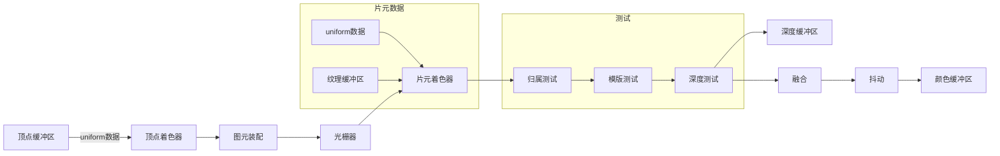
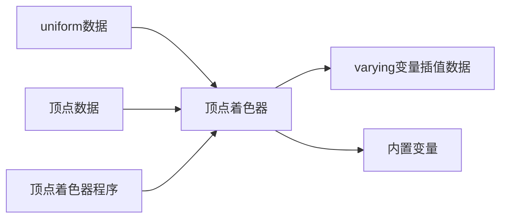
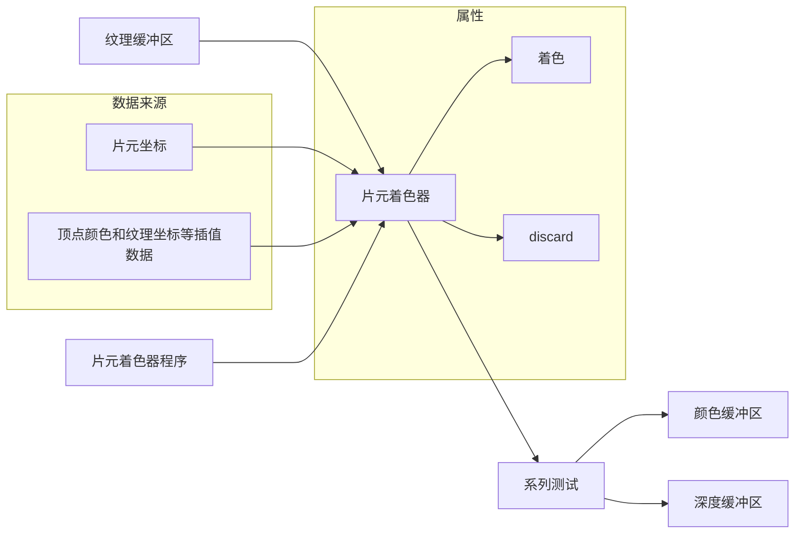
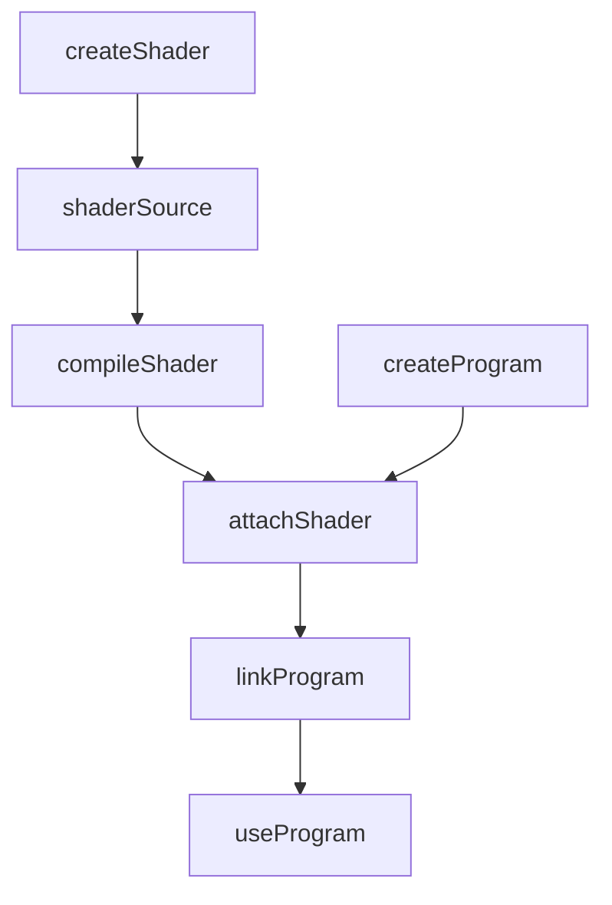

# webGL 概述及一维点绘制

## WebGL 容器（坐标系）

WebGL 使用的是正交右手坐标系，且每个方向都有可使用的值的区间，超出该矩形区间的图像不会绘制
x，y，z 的区间都是-1 到 1
注：这些值与 Canvas 的尺寸无关，无论 Canvas 的长宽比是多少，WebGL 的区间值都是一致的

## WebGL 渲染管线



### 顶点着色器

顶点着色器是 GPU 渲染管线上一个可以执行着色器语言的功能单元，具体执行的就是顶点着色器程序，WebGL 顶点着色器程序在 Javascript 中以字符串的形式存在，通过编译处理后传递给顶点着色器执行。 顶点着色器主要作用就是执行顶点着色器程序对顶点进行变换计算，比如顶点位置坐标执行进行旋转、平移等矩阵变换，变换后新的顶点坐标然后赋值给内置变量 gl_Position，作为顶点着色器的输出，图元装配和光栅化环节的输入。



varying 变量插值数据

- attribute 存储限定符，必须声明为全局变量，数据将从着色器外部传给该变量。
- uniform

内置变量

- gl_Position vec4 表示定点位置
- gl_PointSize float 表示点的尺寸（像素版）默认值为1.0，类型限制，如可以赋值为40.0，但是不能是40。
- gl_FrontFacing

### 图元装配

顶点变换后的操作是图元装配(primitive assembly)，从程序的角度来看，就是绘制函数 drawArrays()或 drawElements()第一个参数绘制模式 mode 控制顶点如何装配为图元， gl.LINES 的定义的是把两个顶点装配成一个线条图元，gl.TRIANGLES 定义的是三个顶点装配为一个三角面图元，gl.POINTS 定义的是一个点域图元。

### 光栅化

简单理解就是将上一步的图元装配划分成一小块，这里的一小块就是光栅

### 片元着色器

片元着色器和顶点着色器一样是 GPU 渲染管线上一个可以执行着色器程序的功能单元，顶点着色器处理的是逐顶点处理顶点数据，片元着色器是逐片元处理片元数据。通过给内置变量 gl_FragColor 赋值可以给每一个片元进行着色， 值可以是一个确定的 RGBA 值，可以是一个和片元位置相关的值，也可以是插值后的顶点颜色。除了给片元进行着色之外，通过关键字 discard 还可以实现哪些片元可以被丢弃，被丢弃的片元不会出现在帧缓冲区，自然不会显示在 canvas 画布上。



## 案例：绘制一个点

以 html 为例，先添加一个目标 canvas 到页面上，并且添加一个 init 方法调用，页面加载完成之后会执行 init 方法

这里还引入了一个 glMatrix.js（用于高性能 WebGL 应用程序的 JavaScript 矩阵和矢量库）[官网在这，这个JS可以在这下载](https://glmatrix.net/)。

```html
<script src="./glMatrix-0.9.6.min.js"></script>
<body onload="init()">
  <canvas id="webgl" width="1024" height="768" />
</body>
```

在 init 方法当中拆分几个方法进行实现，首先是初始化 WebGL。[WebGL 的 API 文档](https://developer.mozilla.org/zh-CN/docs/Web/API/WebGLRenderingContext)

- 通过 getContext 来获取 canvas 元素的 WebGL 绘图上下文
- viewport 方法设置视口，即指定从标准设备到窗口坐标的 x、y 仿射变换
  - 参数分别 x，y，width，height（左下角坐标以及视口宽高）
- mat4.ortho

```js
var webGL;

function init() {
  initWebGL();
  initShader();
  initBuffer();
  draw();
}

function initWebGL() {
  let webGLdiv = document.getElementById("webgl");
  webGL = webGLdiv.getContext("webgl");
  webGL.viewport(0, 0, webGLdiv.clientWidth, webGLdiv.clientHeight);
  mat4.ortho(
    0,
    webGLdiv.clientWidth,
    webGLdiv.clientHeight,
    0,
    -1,
    1,
    projMat4
  );
}
```

初始化 shader 着色器，其中关于着色器的代码可以先略过，然后就是创建 shader 的流程，其中引入的 mat4 的 proj，再一次通过 proj\*a_position 得到的 gl_Position 会被重新应用到 webGL 的坐标系，也就把 webGL 坐标系又变成了传统的 canvas 左上角坐标系



```js
var program;
// 顶点着色器
var vertexString = `
    attribute vec4 a_position;
    uniform mat4 proj;
    void main(){
        gl_Position = proj * a_position;
        gl_PointSize = 60.0;
    }`;

// 片元着色器
var fragmentString = `
    void main(){
        gl_FragColor = vec4(1.0, 0.0, 0.0, 1.0);
    }`;

function initShader() {
  // 创建着色器对象（顶点、片元）
  let vsShader = webGL.createShader(webGL.VERTEX_SHADER);
  let fsShader = webGL.createShader(webGL.FRAGMENT_SHADER);

  // 绑定着色器源代码
  webGL.shaderSource(vsShader, vertexString);
  webGL.shaderSource(fsShader, fragmentString);

  // 编译着色器对象
  webGL.compileShader(vsShader);
  webGL.compileShader(fsShader);

  // 创建程序对象和shader对象进行绑定
  program = webGL.createProgram();
  webGL.attachShader(program, vsShader);
  webGL.attachShader(program, fsShader);

  // webGL和项目中间进行绑定和使用
  webGL.linkProgram(program);
  webGL.useProgram(program);
}
```

- 创建单个点对象，注明为 Float32Array 类型
- getAttribLocation 返回了给定 WebGLProgram 对象中某属性的下标指向位置，前面的着色器的 a_position，就是这个属性的下标位置
- vertexAttrib4fv 是给顶点进行赋值，也就是顶点着色器中的 gl_Position = proj \* a_position
  - 参数一：是指定了待修改顶点 attribute 变量的存储位置
  - 参数二：是用于设置顶点 attibute 变量的向量值
  - 拓展：同族函数 vertexAttrib1fv、vertexAttrib2fv、vertexAttrib3fv（其中数字代表几个参数、f表示float）
- getUniformLocation 是返回 uniform 变量的指针位置
- uniformMatrix4fv 为 uniform 变量指定矩阵值
  - 参数一：是指定待修改 uniform 变量的存储位置
  - 参数二：指定是否转置矩阵
  - 参数三：序列值

```js
function initBuffer() {
  // 创建一个x=100,y=100的点
  let pointPosition = new Float32Array([100, 100, 0, 1]);
  let aPosition = webGL.getAttribLocation(program, "a_position");

  webGL.vertexAttrib4fv(aPosition, pointPosition);

  let uniformProj = webGL.getUniformLocation(program, "proj");
  webGL.uniformMatrix4fv(uniformProj, false, projMat4);
}
```

最后一步进行绘制

- clearColor 方法用于设置清空颜色缓冲时的颜色值，参数为 rgba 值（取值在 0-1 之间）
- clear 方法使用预设值来清空缓冲（参数可选）
  - gl.COLOR_BUFFER_BIT 颜色缓冲区
  - gl.DEPTH_BUFFER_BIT 深度缓冲区
  - gl.STENCIL_BUFFER_BIT 模板缓冲区
- drawArrays 方法为渲染数组中的原始数据
  - mode：[可选值](https://developer.mozilla.org/zh-CN/docs/Web/API/WebGLRenderingContext/drawArrays#%E5%8F%82%E6%95%B0)
  - first：指定从哪个点开始绘制
  - count：指定绘制的点的数量

```js
function draw() {
  webGL.clearColor(0, 0, 0, 1);
  webGL.clear(webGL.COLOR_BUFFER_BIT);
  webGL.drawArrays(webGL.POINTS, 0, 1);
}
```

## 案例拓展：鼠标单击后绘制点

思路在于需要监听鼠标的单击事件，而后获取鼠标的坐标，将每一次点击的坐标记录在一个数组当中，之后再调用 draw 方法进行绘制即可

修改 initBuffer() 方法

- 创建一个全局存坐标的 POINTS 数组变量
- 添加鼠标点击事件，这里需要进行数据处理，原因在于鼠标点击的是基于左上角的 px 位置，而在 webGL 当中需要转换成-1 到 1 之间的值。（求出targetX 和 targetY，这里偷个懒，里面的1024和768是canvas的宽高，按道理来说应该获取一下，这里就直接写死了）
- 在前面顶点着色器定义的是 vec4 四维变量，所以将 z 设置为 0 表示在平面，并且 a 的值设置为 1 表示不透明
- 覆盖单个点的 pointPosition
- 创建缓冲区：createBuffer()方法是用于储存顶点数据或着色数据的 WebGLBuffer 对象
- 绑定缓冲区：bindBuffer()方法是把 WebGLBuffer 对象绑定到指定目标上
  - 参数一：gl.ARRAY_BUFFER: 包含顶点属性的 Buffer，如顶点坐标，纹理坐标数据或顶点颜色数据。
  - 参数二：buffer 对象
- 更新缓冲数据：bufferData()方法是创建并初始化了 Buffer 对象的数据存储区
  - 参数一：指定 Buffer 绑定点（目标）
    - gl.ARRAY_BUFFER: 包含顶点属性的 Buffer，如顶点坐标，纹理坐标数据或顶点颜色数据
    - gl.ELEMENT_ARRAY_BUFFER: 用于元素索引的 Buffer。
  - 参数二：设定 Buffer 对象的数据存储区大小
  - 参数三：指定数据存储区的使用方法
    - gl.STATIC_DRAW: 缓冲区的内容可能经常使用，而不会经常更改。内容被写入缓冲区，但不被读取
    - gl.DYNAMIC_DRAW: 缓冲区的内容可能经常被使用，并且经常更改。内容被写入缓冲区，但不被读取
    - gl.STREAM_DRAW: 缓冲区的内容可能不会经常使用。内容被写入缓冲区，但不被读取
- enableVertexAttribArray()方法是在给定的位置，启用顶点 attribute 数组
- vertexAttribPointer()方法是指定一个顶点 attributes 数组中，顶点 attributes 变量的数据格式和位置
  - 参数一：指定要修改的顶点属性的索引
  - 参数二：指定每个顶点属性的组成数量，必须是 1，2，3 或 4
  - 参数三：指定数组中每个元素的数据类型可能是，可取【gl.BYTE、gl.SHORT、gl.UNSIGNED_BYTE、gl.UNSIGNED_SHORT、gl.FLOAT】
  - 参数四：当转换为浮点数时是否应该将整数数值归一化到特定的范围
  - 参数五：以字节为单位指定连续顶点属性开始之间的偏移量
  - 参数六：指定顶点属性数组中第一部分的字节偏移量
- 再最后调用 draw 方法进行绘制

```js
const POINTS = [];
function initBuffer() {
  // 创建一个x=100,y=100的点

  let aPosition = webGL.getAttribLocation(program, "a_position");

  document.addEventListener("mousedown", (e) => {
    // 将canvas的点转换成webGL的点
    const targetX = (e.clientX - 1024 / 2) / (1024 / 2);
    const targetY = (768 / 2 - e.clientY) / (768 / 2);
    console.log(targetX, targetY);

    POINTS.push(targetX);
    POINTS.push(targetY);
    POINTS.push(0);
    POINTS.push(1);

    let pointPosition = new Float32Array(POINTS);

    let pointBuffer = webGL.createBuffer();

    webGL.bindBuffer(webGL.ARRAY_BUFFER, pointBuffer);

    webGL.bufferData(webGL.ARRAY_BUFFER, pointPosition, webGL.STATIC_DRAW);

    webGL.enableVertexAttribArray(aPosition);

    webGL.vertexAttribPointer(aPosition, 4, webGL.FLOAT, false, 4 * 4, 0 * 4);

    webGL.vertexAttrib4fv(aPosition, pointPosition);

    let uniformProj = webGL.getUniformLocation(program, "proj");
    webGL.uniformMatrix4fv(uniformProj, false, projMat4);

    draw();
  });
}
```

修改 draw()方法，只用修改绘制的目标为 POINTS 并且设置长度

注：因为在 initBuffer 当中重新调整了坐标位置也就是现在的坐标位置是-1 到 1 之间，所以在顶点着色器当中的 gl_Position = a_position 而不是
gl_Position = proj \* a_position

```js
function draw() {
  webGL.clearColor(0, 0, 0, 1);
  webGL.clear(webGL.COLOR_BUFFER_BIT | webGL.DEPTH_BUFFER_BIT);
  webGL.drawArrays(webGL.POINTS, 0, POINTS.length);
}
```

